# CCNA Networking Lab Portfolio

A growing collection of Cisco Packet Tracer labs documenting my hands-on CCNA practice.


## Table of Contents

- [Overview](#overview)
- [What This Repo Shows](#what-this-repo-shows)
- [Lab Files](#lab-files)
- [Topology Snapshot](#topology-snapshot)
- [Addressing Plan](#addressing-plan)
- [HSRP Documentation](#hsrp-documentation)
- [VTP Documentation](#vtp-documentation)
- [PVST Documentation](#pvst-documentation)
- [EtherChannel Documentation](#etherchannel-documentation)
- [OSPF Documentation](#ospf-documentation)
- [NAT Documentation](#nat-documentation)
- [Extended ACL Documentation](#extended-acl-documentation)
- [DNS and DHCP Documentation](#dns-and-dhcp-documentation)
- [NTP Documentation](#ntp-documentation)
- [SNMP and Syslog Documentation](#snmp-and-syslog-documentation)
- [SSH Documentation](#ssh-documentation)
- [VoIP Documentation](#voip-documentation)
- [Wireless LAN Documentation](#wireless-lan-documentation)
- [QoS Documentation](#qos-documentation)
- [Port Security Documentation](#port-security-documentation)
- [DHCP Snooping and DAI Documentation](#dhcp-snooping-and-dai-documentation)
- [Configuration Workflow](#configuration-workflow)
- [Design Notes](#design-notes)
- [Next Steps](#next-steps)

## Overview

This repository serves as my **networking portfolio** while I work through my CCNA course and build practical configuration skills in Packet Tracer.

Instead of treating each topic as a completely separate project, I use an **evolving topology** that becomes more advanced over time. That approach helps me practice how networks are built, expanded, verified, and troubleshot.

## What This Repo Shows

- VLAN creation and segmentation
- VTP and trunking between switches
- Inter-VLAN routing with SVIs and Layer 3 switching
- RSTP, PortFast, BPDU Guard, and Root Guard
- EtherChannel for redundancy and bandwidth
- OSPF routing and failover path behavior
- OSPF Equal-Cost Multi-Path (ECMP) across dual-homed routed links
- HSRP for resilient IPv4 default gateways
- IPv4 and IPv6 dual-stack addressing
- Static routing, NAT/PAT, and WAN edge connectivity
- Extended ACL policy enforcement for service-based access control
- Centralized DNS and DHCP services for user and voice VLANs
- Centralized NTP for consistent device timestamps across routers and switches
- Wireless LAN integration with a Cisco WLC, guest VLAN, and Packet Tracer wireless workaround
- Basic SNMP and syslog monitoring validation in Packet Tracer
- Restricted SSH management access from the IT VLAN
- VoIP phone access ports with a separate voice VLAN
- QoS classification, DSCP EF marking, trust boundaries, and strict priority queueing for voice traffic
- Port security with sticky secure MAC learning on user-facing access ports and manually defined secure MACs for fixed services hosts
- DHCP snooping and Dynamic ARP Inspection with trusted uplinks, rogue DHCP blocking, IP/MAC validation, and access-port rate-limit testing

## Lab Files

These Packet Tracer labs are stored in `labs/` and show the progression of the topology and the topics covered. The latest lab file in the repository is `labs/Wireless LAN.pkt`.

| Lab File | Main Focus |
|---|---|
| `labs/VTP.pkt` | VLAN propagation and switch domain setup |
| `labs/VLAN (ROAS).pkt` | Router-on-a-stick and inter-VLAN routing |
| `labs/VLAN (P2P).pkt` | Layer 3 switching with SVIs and routed links |
| `labs/RSTP.pkt` | Spanning-tree protection features |
| `labs/Etherchannel.pkt` | Aggregated uplinks and redundancy |
| `labs/HSRP.pkt` | HSRP active/standby IPv4 default gateway redundancy |
| `labs/OSPF.pkt` | Dynamic routing and path preference |
| `labs/Core Routers Redundancy.pkt` | Routed failover and OSPF ECMP testing between `CR1`, `CR2`, and the distribution layer |
| `labs/IPv6.pkt` | Dual-stack addressing with IPv6 static routes |
| `labs/Extended ACL.pkt` | Per-VLAN extended ACLs for service-based access control |
| `labs/DNS & DHCP.pkt` | Centralized DNS and DHCP services added to the services VLAN |
| `labs/SNMP & Syslog.pkt` | SNMP communities and syslog testing to the admin server |
| `labs/NAT.pkt` | `EDGE` PAT overload for inside local networks and internet access |
| `labs/SSH.pkt` | SSH management access enabled on distribution switches with IT VLAN restrictions |
| `labs/QoS.pkt` | VoIP and QoS lab with preserved DSCP markings and priority queue validation |
| `labs/Port Security.pkt` | Access-layer security lab with sticky learning, manual secure MACs, and restrict-mode violations |
| `labs/DHCP Snooping.pkt` | Layer 2 security lab with DHCP snooping, rogue DHCP blocking, and rate-limit testing |
| `labs/ARP Inspection.pkt` | Latest Layer 2 security lab with Dynamic ARP Inspection added on top of DHCP snooping validation |
| `labs/Wireless LAN.pkt` | Wireless LAN controller, APs, and Guest wireless VLAN |

## Topology Snapshot

The current lab design includes:

- Seven VLANs: HR, Sales, IT, Services, Guest Wireless, Voice, and WLC Management
- Two distribution / multilayer switches acting as primary and backup gateways
- An EtherChannel bundle between `DSW1-MAIN` and `DSW2-BACKUP` for inter-switch redundancy
- Redundant uplinks between access and distribution layers
- Dual-homed routed uplinks between `CR1` / `CR2` and both distribution switches for load balancing and redundancy
- Dual upstream routers connected to the `EDGE` internet router
- Dynamic NAT overload (PAT) on `EDGE` for inside local addresses reaching outside networks
- Centralized services in `VLAN 40`, including file, admin (w/DNS, NTP, syslog), web, and DHCP servers
- DHCP scope delivery for data VLANs `10`, `20`, and `30`, plus the voice VLAN `100`
- Guest wireless in `VLAN 50` with **WLC-managed DHCP** and wireless client testing
- A dedicated WLC management VLAN `99` for controller management, CAPWAP, and DHCP proxy behavior
- Cisco IP phones added at the access layer with a dedicated `VLAN 100` voice segment
- QoS policy testing with DSCP marking at `ASW1`, DSCP trust at `DSW1-MAIN` and `DSW2-BACKUP`, and egress priority queueing on routed devices such as `CR1`, `CR2`, and `EDGE`
- Port security on access ports, using sticky learning on `ASW1` and `ASW2` plus manually configured secure MAC addresses on `ASW3`
- DHCP snooping enabled to protect the centralized DHCP design from rogue DHCP offers and DHCP message flooding
- Dynamic ARP Inspection enabled on the same access-layer VLANs to validate ARP packets against trusted bindings
- A rogue DHCP test server connected to `ASW1` on `GigabitEthernet1/0/6` for validation
- IPv4 and IPv6 addressing throughout the environment

## Addressing Plan

### VLAN Networks

| VLAN | Department | IPv4 Subnet | IPv4 Gateway | IPv6 Subnet | IPv6 Router Addressing |
|---|---|---|---|---|---|
| 10 | HR | `192.168.10.0/24` | `192.168.10.254` | `2001:DB8:10::/64` | `2001:DB8:10::252` (`DSW1-MAIN`), `2001:DB8:10::253` (`DSW2-BACKUP`) |
| 20 | Sales | `192.168.20.0/24` | `192.168.20.254` | `2001:DB8:20::/64` | `2001:DB8:20::252` (`DSW1-MAIN`), `2001:DB8:20::253` (`DSW2-BACKUP`) |
| 30 | IT | `192.168.30.0/24` | `192.168.30.254` | `2001:DB8:30::/64` | `2001:DB8:30::252` (`DSW1-MAIN`), `2001:DB8:30::253` (`DSW2-BACKUP`) |
| 40 | Services | `192.168.40.0/24` | `192.168.40.254` | `2001:DB8:40::/64` | `2001:DB8:40::252` (`DSW1-MAIN`), `2001:DB8:40::253` (`DSW2-BACKUP`) |
| 50 | Guests Wireless | `192.168.50.0/24` | `192.168.50.254` | Not configured in this lab | Not configured in this lab |
| 99 | WLC Management | `192.168.99.0/24` | `192.168.99.254` | Not configured in this lab | Not configured in this lab |
| 100 | Voice | `192.168.100.0/24` | `192.168.100.254` | Not configured in this lab | Not configured in this lab |

### Example End-Host Addressing

| VLAN | Example IPv4 Host | Example IPv6 Host |
|---|---|---|
| 10 | `192.168.10.1` | `2001:DB8:10::1` |
| 20 | `192.168.20.1` | `2001:DB8:20::1` |
| 30 | `192.168.30.1` | `2001:DB8:30::1` |
| 40 | `192.168.40.1` | `2001:DB8:40::1` |
| 50 | `192.168.50.1` | Not used |
| 100 | `192.168.100.1` | Not used |

### Services VLAN Infrastructure

| Service | Hostname | IPv4 Address | Role |
|---|---|---|---|
| File Server | `file.services.local` | `192.168.40.1` | FTP service for `VLAN 10` testing with account `hr` / `hr` |
| Admin Server | `admin.services.local` | `192.168.40.2` | DNS, NTP, and syslog receiver for the lab |
| Web Server | `web.services.local` | `192.168.40.3` | HTTPS service for `VLAN 20` testing |
| DHCP Server | `dhcp.services.local` | `192.168.40.4` | DHCP pools for `VLAN 10`, `20`, `30`, and `100` |


## HSRP Documentation

The multilayer switches follow a predictable addressing structure to make verification and troubleshooting easier.

For this Packet Tracer lab, HSRP is the FHRP used for IPv4 default gateway redundancy. IPv6 does not use a virtual gateway address here because IPv6 FHRP is not working reliably in Packet Tracer, so the hosts reference the SVI addresses on the multilayer switches instead.

The HSRP active gateway placement is aligned with the spanning-tree root placement so the preferred Layer 2 path and preferred default gateway stay on the same distribution switch for each VLAN group.

### HSRP Summary

| Role | IPv4 Pattern | IPv6 Pattern |
|---|---|---|
| Main multilayer switch SVI | `192.168.x.252` | `2001:DB8:x::252` |
| Backup multilayer switch SVI | `192.168.x.253` | `2001:DB8:x::253` |
| Virtual default gateway | `192.168.x.254` | Not used in this Packet Tracer IPv6 lab |

Replace `x` with the VLAN number such as `10`, `20`, `30`, `40`, or `100`.

### HSRP Active / Standby VLAN Split

| VLAN Group | Active HSRP Device | Standby HSRP Device |
|---|---|---|
| `10`, `30`, `100` | `DSW1-MAIN` | `DSW2-BACKUP` |
| `20`, `40` | `DSW2-BACKUP` | `DSW1-MAIN` |

### Example Configuration

#### DSW1-MAIN

```cisco
interface vlan 10
 standby 10 ip 192.168.10.254
 standby 10 priority 110
 standby 10 preempt
!
interface vlan 20
 standby 20 ip 192.168.20.254
!
interface vlan 30
 standby 30 ip 192.168.30.254
 standby 30 priority 110
 standby 30 preempt
!
interface vlan 40
 standby 40 ip 192.168.40.254
!
interface vlan 100
 standby 100 ip 192.168.100.254
 standby 100 priority 110
 standby 100 preempt
```

#### DSW2-BACKUP

```cisco
interface vlan 10
 standby 10 ip 192.168.10.254
!
interface vlan 20
 standby 20 ip 192.168.20.254
 standby 20 priority 110
 standby 20 preempt
!
interface vlan 30
 standby 30 ip 192.168.30.254
!
interface vlan 40
 standby 40 ip 192.168.40.254
 standby 40 priority 110
 standby 40 preempt
!
interface vlan 100
 standby 100 ip 192.168.100.254
```

### Verification Commands

```cisco
show standby brief
show standby vlan 10
show standby vlan 20
show running-config | section interface Vlan
```

### Verification Screenshots

The screenshots below show the HSRP state aligned with the spanning-tree load-balancing design: `DSW1-MAIN` is active for `VLANs 10, 30, and 100`, while `DSW2-BACKUP` is active for `VLANs 20 and 40`.

#### DSW1-MAIN HSRP State

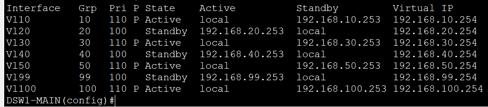

#### DSW2-BACKUP HSRP State

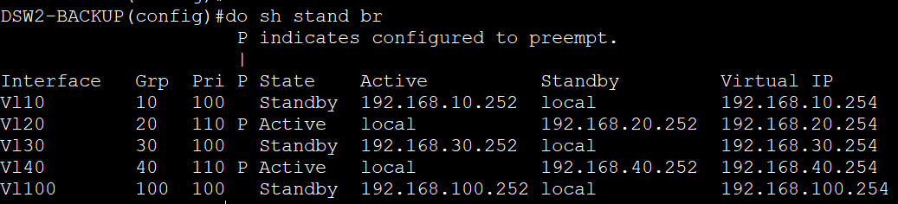

### Distribution-to-Distribution Routed Link

The port-channel between `DSW1-MAIN` and `DSW2-BACKUP` is now configured as a Layer 3 routed interface (no switchport mode) with a `/30` point-to-point connection.

| Link | IPv4 Subnet | DSW1-MAIN Address | DSW2-BACKUP Address | IPv6 Subnet | DSW1-MAIN IPv6 | DSW2-BACKUP IPv6 |
|---|---|---|---|---|---|---|
| `DSW1-MAIN` to `DSW2-BACKUP` | `10.12.12.0/30` | `10.12.12.1` | `10.12.12.2` | `2001:DB8:0:12::/64` | `2001:DB8:0:12::1` | `2001:DB8:0:12::2` |

### Distribution-to-Core Routed Uplinks


| Link | IPv4 Subnet | Router Address | Distribution Switch Address | IPv6 Subnet | Router IPv6 | Distribution Switch IPv6 |
|---|---|---|---|---|---|---|
| `CR1` to `DSW1-MAIN` | `10.0.0.0/30` | `10.0.0.1` | `10.0.0.2` | `2001:DB8:0:0::/64` | `2001:DB8:0:0::1` | `2001:DB8:0:0::2` |
| `CR1` to `DSW2-BACKUP` | `10.0.0.4/30` | `10.0.0.5` | `10.0.0.6` | `2001:DB8:0:1::/64` | `2001:DB8:0:1::1` | `2001:DB8:0:1::2` |
| `CR2` to `DSW2-BACKUP` | `10.0.0.8/30` | `10.0.0.9` | `10.0.0.10` | `2001:DB8:0:2::/64` | `2001:DB8:0:2::1` | `2001:DB8:0:2::2` |
| `CR2` to `DSW1-MAIN` | `10.0.0.12/30` | `10.0.0.13` | `10.0.0.14` | `2001:DB8:0:3::/64` | `2001:DB8:0:3::1` | `2001:DB8:0:3::2` |

### Point-to-Point WAN Links

| Link | IPv4 Subnet | Internal Router Address | EDGE / Next-Hop Address | IPv6 Subnet | Internal Router IPv6 | EDGE IPv6 |
|---|---|---|---|---|---|---|
| CR1 to EDGE | `203.0.113.0/30` | `203.0.113.1` | `203.0.113.2` | `2001:DB8:113:1::/64` | `2001:DB8:113:1::1` | `2001:DB8:113:1::2` |
| CR2 to EDGE | `203.0.113.4/30` | `203.0.113.5` | `203.0.113.6` | `2001:DB8:113:2::/64` | `2001:DB8:113:2::1` | `2001:DB8:113:2::2` |
| EDGE to Internet | `203.0.113.8/30` | `203.0.113.9` | `203.0.113.10` | `2001:DB8:113:3::/64` | `2001:DB8:113:3::1` | `2001:DB8:113:3::2` |

### IPv6 Static Routing Summary

Static routes are intentionally used for IPv6 in this lab for practice instead of OSPFv3.

On the core routers, the internal IPv6 static routes are aligned with the HSRP active gateway split. The preferred path follows the distribution switch that is active for that VLAN.

| Device | Destination Prefixes | Exit Interface | Next Hop | Purpose |
|---|---|---|---|---|
| `INTERNET` | `2001:DB8:10::/64`, `20::/64`, `30::/64` | `g0/0` | `2001:DB8:113:3::2` | Return internal VLAN traffic toward `EDGE` |
| `EDGE` | `2001:DB8:10::/64`, `20::/64`, `30::/64` | `g0/0` | `2001:DB8:113:1::1` | Reach internal VLANs through `CR1` |
| `EDGE` | `2001:DB8:10::/64`, `20::/64`, `30::/64` | `g0/1` | `2001:DB8:113:2::1` | Reach internal VLANs through `CR2` |
| `EDGE` | `::/0` | `g0/2` | `2001:DB8:113:3::1` | Forward upstream toward `INTERNET` |
| `CR1` | `2001:DB8:10::/64`, `2001:DB8:30::/64` | `g0/0` | `2001:DB8:0:0::2` | Primary path through `DSW1-MAIN` for VLANs active on `DSW1-MAIN` |
| `CR1` | `2001:DB8:10::/64`, `2001:DB8:30::/64` | `g0/2` | `2001:DB8:0:1::2` | Floating backup path through `DSW2-BACKUP` with administrative distance `10` |
| `CR1` | `2001:DB8:20::/64` | `g0/2` | `2001:DB8:0:1::2` | Primary path through `DSW2-BACKUP` for VLANs active on `DSW2-BACKUP` |
| `CR1` | `2001:DB8:20::/64` | `g0/0` | `2001:DB8:0:0::2` | Floating backup path through `DSW1-MAIN` with administrative distance `10` |
| `CR2` | `2001:DB8:10::/64`, `2001:DB8:30::/64` | `g0/2` | `2001:DB8:0:3::2` | Primary path through `DSW1-MAIN` for VLANs active on `DSW1-MAIN` |
| `CR2` | `2001:DB8:10::/64`, `2001:DB8:30::/64` | `g0/0` | `2001:DB8:0:2::2` | Floating backup path through `DSW2-BACKUP` with administrative distance `10` |
| `CR2` | `2001:DB8:20::/64` | `g0/0` | `2001:DB8:0:2::2` | Primary path through `DSW2-BACKUP` for VLANs active on `DSW2-BACKUP` |
| `CR2` | `2001:DB8:20::/64` | `g0/2` | `2001:DB8:0:3::2` | Floating backup path through `DSW1-MAIN` with administrative distance `10` |
| `DSW1-MAIN` | `::/0` | `g1/0/4` | `2001:DB8:0:0::1` | Primary upstream path through `CR1` |
| `DSW1-MAIN` | `::/0` | `g1/0/7` | `2001:DB8:0:3::1` | Secondary upstream path through `CR2` |
| `DSW2-BACKUP` | `::/0` | `g1/0/4` | `2001:DB8:0:2::1` | Primary upstream path through `CR2` |
| `DSW2-BACKUP` | `::/0` | `g1/0/7` | `2001:DB8:0:1::1` | Secondary upstream path through `CR1` |

## VTP Documentation

This section documents the basic VTP setup used in the switching portion of the lab.

### Design Summary

- The VTP domain is configured as `cisco`.
- `DSW1-MAIN` is configured as the VTP server for VLAN management.
- This setup is kept intentionally simple because the lab is also being used to study VLAN provisioning and future automation or scripting workflows.

### Example Configuration

#### DSW1-MAIN

```cisco
vtp domain cisco
vtp mode server
```

#### VTP Clients

```cisco
vtp domain cisco
vtp mode client
```

### Verification Commands

```cisco
show vtp status
show vlan brief
```

## PVST Documentation

This section documents the PVST configuration used to stabilize Layer 2 paths and protect edge ports.

### Design Summary

- PVST is enabled for per-VLAN spanning-tree control.
- Per-VLAN load balancing is used across the distribution pair instead of making one switch the root primary for every VLAN.
- `DSW1-MAIN` is the root primary switch for `VLANs 10, 30, and 100` and root secondary for `VLANs 20 and 40`.
- `DSW2-BACKUP` is the root primary switch for `VLANs 20 and 40` and root secondary for `VLANs 10, 30, and 100`.
- This spreads Layer 2 forwarding paths across both distribution switches while still preserving deterministic failover behavior.
- The STP root split is intentionally aligned with the HSRP active gateway split to keep forwarding local to the preferred distribution switch during normal operation.
- STP protections, including PortFast, BPDU Guard, and Root Guard, are applied on the access switches rather than on the distribution switches.
- On the access switches, these features speed host connectivity and help prevent accidental switch connections or unexpected root-bridge changes.

### Example Configuration

#### DSW1-MAIN

```cisco
spanning-tree mode pvst
spanning-tree vlan 10,30,100 root primary
spanning-tree vlan 20,40 root secondary
```

#### DSW2-BACKUP

```cisco
spanning-tree mode pvst
spanning-tree vlan 20,40 root primary
spanning-tree vlan 10,30,100 root secondary
```

#### Access Switch Edge Protection

```cisco
spanning-tree mode pvst
spanning-tree portfast default
spanning-tree bpduguard default
```

### Verification Commands

```cisco
show spanning-tree
show spanning-tree vlan 10
show spanning-tree root
show spanning-tree summary
show spanning-tree inconsistentports
```

## EtherChannel Documentation

This section documents the EtherChannel link configured between `DSW1-MAIN` and `DSW2-BACKUP`.

### Design Summary

- The Layer 3 Port-Channel between distribution switches provides a routed interconnect for deterministic traffic flow, inter-VLAN reachability, and resiliency. It also forms an OSPF adjacency for IPv4, enabling dynamic routing and fast convergence while eliminating Layer 2 dependencies like STP and preventing suboptimal forwarding.
  

### IPv4 and IPv6 Addressing

| Device | IPv4 Address | IPv6 Address |
|---|---|---|
| `DSW1-MAIN` | `10.12.12.1/30` | `2001:DB8:0:12::1/64` |
| `DSW2-BACKUP` | `10.12.12.2/30` | `2001:DB8:0:12::2/64` |

### Verification Commands

```cisco
show etherchannel summary
show interfaces port-channel
show ip interface port-channel
show ipv6 interface port-channel
```

### Verification Screenshot

The screenshot below shows the LACP EtherChannel up between `DSW1-MAIN` and `DSW2-BACKUP`, with `Port-channel1` in use as a routed interface and both member links bundled successfully.

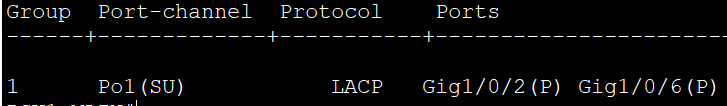

## OSPF Documentation

This section documents the OSPF design used for dynamic routing and failover behavior in the lab.

### Loopback Router IDs

| Device | Loopback Address | OSPF Router ID |
|---|---|---|
| `DSW1-MAIN` | `1.1.1.1/32` | `1.1.1.1` |
| `DSW2-BACKUP` | `2.2.2.2/32` | `2.2.2.2` |
| `CR1` | `3.3.3.3/32` | `3.3.3.3` |
| `CR2` | `4.4.4.4/32` | `4.4.4.4` |
| `EDGE` | `5.5.5.5/32` | `5.5.5.5` |

### OSPF Design Summary

- Each Layer 3 device uses a loopback interface to provide a stable OSPF router ID.
- OSPF is configured in a single area only: `area 0`.
- On the multilayer switches, VLAN SVIs are advertised through `network` statements with wildcard masks under the OSPF process.
- Physical routed interfaces are enabled individually under the interface with `ip ospf 1 area 0`.
- OSPF is used to advertise IPv4 internal routed paths and upstream connectivity across the lab.
- IPv6 reachability is intentionally built with static routes for practice instead of OSPFv3.
- This topology implements OSPF Equal-Cost Multi-Path (ECMP) between the dual-homed distribution switches and core routers.
- `EDGE` originates the default route into OSPF so the internal routers learn outside reachability.
- The topology is designed so path preference and failover can be observed when the primary route changes or becomes unavailable.

### Example Loopback and Router ID Configuration

#### DSW1-MAIN

```cisco
interface loopback0
 ip address 1.1.1.1 255.255.255.255
!
router ospf 1
 router-id 1.1.1.1
 network 1.1.1.1 0.0.0.0 area 0
 network 192.168.10.0 0.0.0.255 area 0
 network 192.168.20.0 0.0.0.255 area 0
 network 192.168.30.0 0.0.0.255 area 0
 network 192.168.40.0 0.0.0.255 area 0
```

#### DSW2-BACKUP

```cisco
interface loopback0
 ip address 2.2.2.2 255.255.255.255
!
router ospf 1
 router-id 2.2.2.2
 network 2.2.2.2 0.0.0.0 area 0
 network 192.168.10.0 0.0.0.255 area 0
 network 192.168.20.0 0.0.0.255 area 0
 network 192.168.30.0 0.0.0.255 area 0
 network 192.168.40.0 0.0.0.255 area 0
```

#### CR1

```cisco
interface loopback0
 ip address 3.3.3.3 255.255.255.255
!
router ospf 1
 router-id 3.3.3.3
```

#### CR2

```cisco
interface loopback0
 ip address 4.4.4.4 255.255.255.255
!
router ospf 1
 router-id 4.4.4.4
```

#### EDGE

```cisco
ip route 0.0.0.0 0.0.0.0 203.0.113.10
!
router ospf 1
 default-information originate
```

### Verification Commands

```cisco
show ip ospf neighbor
show ip ospf database
show ip route ospf
show ip ospf interface brief
show ip protocols
```

### Verification Screenshots

The screenshot below shows `DSW1-MAIN` verifying a healthy and stable OSPF link-state database. The full topology is present, the expected IPv4 routes and LSAs are visible, the external default route from `EDGE` is present, and there are no signs of database instability in the output.

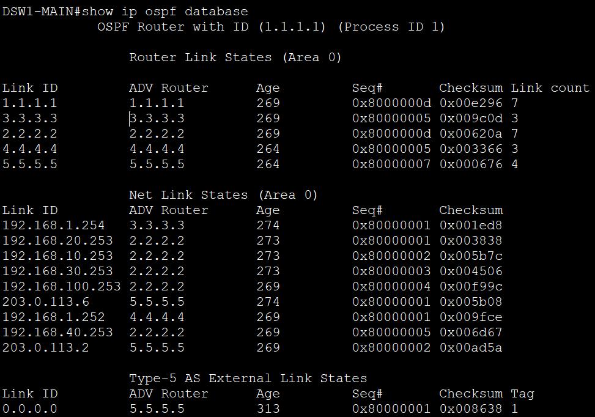

The screenshots below show ECMP-enabled OSPF routing on both distribution switches.

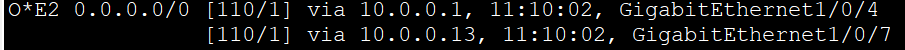

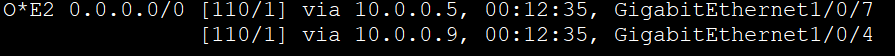

The image below shows simultaneous pings from `PC1`, `PC2`, and `PC3` load balancing across the dual core paths, including traffic using `CR2`.

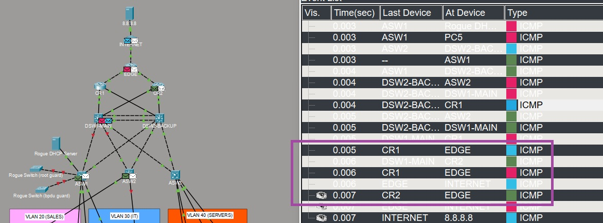

### Core Redundancy Test Animation

The animation below shows the core redundancy test in action. It captures failover behavior across the dual-homed routed design so the path change between `CR1`, `CR2`, and the distribution layer can be observed visually during testing.

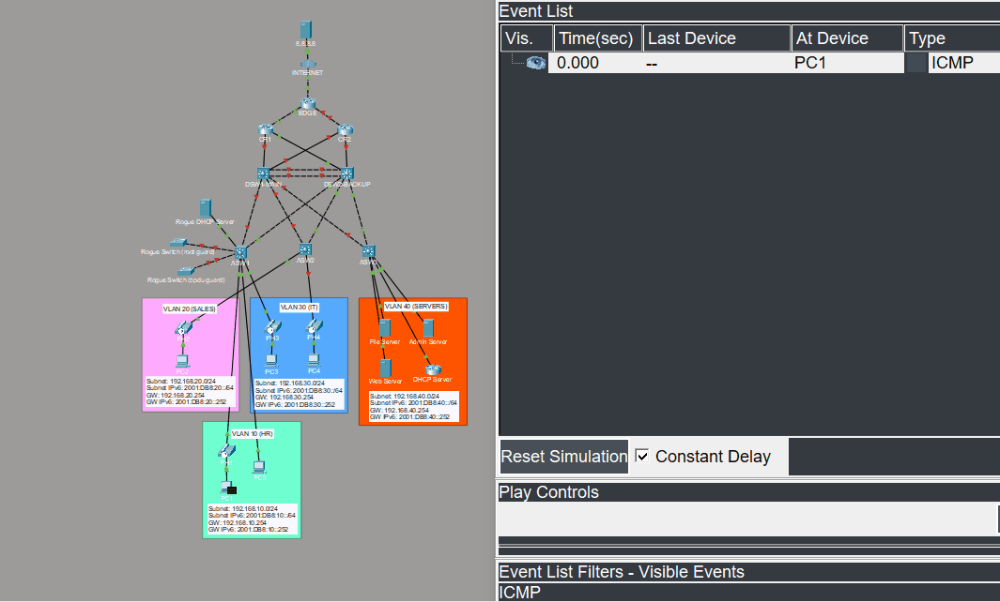

## NAT Documentation

This section documents the `EDGE` router configuration used to provide outside connectivity for the internal lab networks.

### NAT Summary

- `EDGE` is the internet-edge router for the lab.
- Dynamic NAT overload (PAT) is used so inside local addresses can share the public outside interface when reaching external networks.
- The NAT ACL permits the internal `192.168.0.0/16` address space.
- Internal-facing interfaces on `EDGE` are configured as `ip nat inside`, and the internet-facing interface is configured as `ip nat outside`.
- `EDGE` uses a default route to `203.0.113.10` and advertises that default route into OSPF.
- Hosts in the internal VLANs can reach external destinations such as the `8.8.8.8` internet server through PAT.

### NAT ACL on EDGE

```cisco
ip access-list standard NAT_IN
 permit 192.168.0.0 0.0.255.255
```

### Example PAT and Routing Configuration

```cisco
interface <inside-interface>
 ip nat inside
!
interface <outside-interface>
 ip nat outside
!
ip nat inside source list NAT_IN interface <outside-interface> overload
ip route 0.0.0.0 0.0.0.0 203.0.113.10
!
router ospf 1
 default-information originate
```

### NAT Test

The screenshot below shows `EDGE` building PAT translations while an inside host reaches the `8.8.8.8` internet server.


### Verification Commands

```cisco
show access-lists NAT_IN
show ip nat translations
show ip nat statistics
show ip route
show ip protocols
```

## Extended ACL Documentation

This section documents the named extended ACL policy applied on both `DSW1-MAIN` and `DSW2-BACKUP` in the Packet Tracer lab.

### Policy Summary

- `HR_IN` is applied inbound on `VLAN 10` and permits DHCP first, DNS second, and FTP third for HR clients.
- `HR_OUT` is applied outbound on `VLAN 10` and permits the matching DHCP, DNS, and FTP return traffic back toward the HR subnet.
- `SALES_IN` is applied inbound on `VLAN 20` and permits DHCP first, DNS second, and HTTPS third for Sales clients.
- `SALES_OUT` is applied outbound on `VLAN 20` and permits the matching DHCP, DNS, and HTTPS return traffic back toward the Sales subnet.
- The same ACL definitions and interface bindings are configured on both `DSW1-MAIN` and `DSW2-BACKUP` so the policy remains consistent during gateway failover.
- Traffic that does not match those permitted services is dropped by the ACLs' implicit deny.

### Service Test Setup

- DNS is hosted on the admin server at `192.168.40.2` in `VLAN 40`.
- The current DNS `A` records are `admin.services.local`, `dhcp.services.local`, `file.services.local`, and `web.services.local`.
- HR clients use DNS plus FTP to reach the file server, while Sales clients use DNS plus HTTPS to reach the web server.
- The HR FTP validation account is username `hr` with password `hr`.

### ACL Configuration on DSW1-MAIN and DSW2-BACKUP

```cisco
ip access-list extended HR_IN
 permit udp any eq bootpc any eq bootps
 permit udp 192.168.10.0 0.0.0.255 host 192.168.40.4
 permit udp 192.168.10.0 0.0.0.255 host 192.168.40.2 eq domain
 permit tcp 192.168.10.0 0.0.0.255 host 192.168.40.1 eq ftp
!
ip access-list extended HR_OUT
 permit udp host 192.168.40.4 192.168.10.0 0.0.0.255
 permit udp host 192.168.40.2 eq domain 192.168.10.0 0.0.0.255
 permit tcp host 192.168.40.1 eq ftp 192.168.10.0 0.0.0.255
!
ip access-list extended SALES_IN
 permit udp any eq bootpc any eq bootps
 permit udp 192.168.20.0 0.0.0.255 host 192.168.40.4
 permit udp 192.168.20.0 0.0.0.255 host 192.168.40.2 eq domain
 permit tcp 192.168.20.0 0.0.0.255 host 192.168.40.3 eq 443
!
ip access-list extended SALES_OUT
 permit udp host 192.168.40.4 192.168.20.0 0.0.0.255
 permit udp host 192.168.40.2 eq domain 192.168.20.0 0.0.0.255
 permit tcp host 192.168.40.3 eq 443 192.168.20.0 0.0.0.255
!
interface vlan 10
 ip access-group HR_IN in
 ip access-group HR_OUT out
!
interface vlan 20
 ip access-group SALES_IN in
 ip access-group SALES_OUT out
```

### Intended Behavior

- Hosts in `VLAN 10` can obtain DHCP, resolve `file.services.local` via the admin/DNS server at `192.168.40.2`, and access the FTP service on `192.168.40.1` using `hr` / `hr`.
- Hosts in `VLAN 20` can obtain DHCP, resolve `web.services.local` via the admin/DNS server at `192.168.40.2`, and access the web server at `192.168.40.3` over HTTPS.
- Hosts in `VLAN 20` cannot browse to `web.services.local` over HTTP because the Sales ACL only permits TCP `443` to the web server.
- Return traffic for those approved flows is permitted by the outbound ACLs on `VLAN 10` and `VLAN 20`.
- Other traffic, such as an HR client trying to `ping file.services.local`, is denied after DHCP, DNS, and FTP are matched.

### PC1 ACL Test

The screenshots below show the expected `VLAN 10` behavior from `PC1`: DHCP succeeds first, DNS resolves the FTP server second, FTP is allowed third, and a later ping is denied by the ACL.

#### PC1 DHCP Test


#### PC1 FTP and Ping Test


### PC2 Web Tests

The screenshots below show the expected `VLAN 20` browser behavior from `PC2`: HTTP is denied, while HTTPS is allowed against `web.services.local`.

#### PC2 HTTP Test


#### PC2 HTTPS Test


### Verification Commands

```cisco
show access-lists
show run interface vlan 10
show run interface vlan 20
show ip interface vlan 10
show ip interface vlan 20
show hosts
```

### Packet Tracer Note

Packet Tracer has a known issue where extended ACLs can remain in the saved configuration but stop filtering correctly after the lab is closed and reopened. In this lab, the workaround is to re-apply the ACL to each VLAN interface on `DSW1-MAIN` and `DSW2-BACKUP` after every Packet Tracer restart. The issue is described in this Cisco Community thread: <https://community.cisco.com/t5/switching/packet-tracer-acls-remain-in-config-but-stop-working-after/m-p/5378191#M587005>.

Use the following commands to re-apply the ACL bindings on `DSW1-MAIN` and `DSW2-BACKUP`:

```cisco
interface vlan 10
 ip access-group HR_IN in
 ip access-group HR_OUT out
!
interface vlan 20
 ip access-group SALES_IN in
 ip access-group SALES_OUT out
```

## DNS and DHCP Documentation

This section documents the centralized services added in the `labs/DNS & DHCP.pkt` lab.

### DNS Summary

- The admin server at `192.168.40.2` now hosts DNS for the lab.
- The current `services.local` `A` records are:
  - `file.services.local` -> `192.168.40.1`
  - `admin.services.local` -> `192.168.40.2`
  - `web.services.local` -> `192.168.40.3`
  - `dhcp.services.local` -> `192.168.40.4`
- Packet Tracer does not support DDNS for end hosts, so host devices cannot be reached by domain name unless you create static DNS records for them manually.
- This keeps name resolution centralized in the services VLAN instead of tying DNS to the web server.

### DHCP Summary

- A dedicated DHCP server at `192.168.40.4` provides address pools for `VLAN 10`, `VLAN 20`, `VLAN 30`, and `VLAN 100`.
- Addresses `.250` through `.254` are excluded in each VLAN so they remain available for static assignments such as gateways, routers, and servers.
- Services in `VLAN 40` continue to use static addressing.

### DHCP Excluded Addresses

```cisco
ip dhcp excluded-address 192.168.10.250 192.168.10.254
ip dhcp excluded-address 192.168.20.250 192.168.20.254
ip dhcp excluded-address 192.168.30.250 192.168.30.254
ip dhcp excluded-address 192.168.100.250 192.168.100.254
```

## NTP Documentation

This section documents the time synchronization baseline used across the routing and switching devices in the lab.

### NTP Summary

- The admin server at `192.168.40.2` also acts as the NTP server for the lab.
- All routers and switches are configured to use `192.168.40.2` as their NTP source.
- The lab standard timezone is `AEST`, configured on Cisco devices as `clock timezone AEST 10 0` for Australian Eastern Standard Time (`UTC+10`).
- This keeps timestamps aligned across the topology for troubleshooting, syslog review, and general verification.

### Router and Switch Baseline Configuration

Apply the following on each router and switch in the topology:

```cisco
clock timezone AEST 10 0
ntp server 192.168.40.2
```

### Verification Commands

```cisco
show clock detail
show ntp associations
show running-config | include clock timezone|ntp server
```

## SNMP and Syslog Documentation

This section documents the basic monitoring features added in the `labs/SNMP & Syslog.pkt` lab.

### SNMP Summary

- `CR1` is configured for SNMP community-string based monitoring.
- The configured community strings are `ciscorw` for read/write access and `ciscoro` for read-only access.
- To test SNMP, use the Packet Tracer MIB Browser on any host and query `CR1` at `3.3.3.3` or `10.0.0.1` on UDP port `161`.

### MIB Browser Advanced Tab Example Values

| Setting | Value |
|---|---|
| Address | `3.3.3.3` |
| Port | `161` |
| Read Community | `ciscoro` |
| Write Community | `ciscorw` |
| SNMP Version | `v1` |

### CR1 SNMP Configuration

```cisco
snmp-server community ciscorw RW
snmp-server community ciscoro RO
```

### SNMP Test Screenshot


### Syslog Summary

- Syslog is enabled only on `DSW1-MAIN` in this lab version for testing.
- The admin server at `192.168.40.2` is configured as the syslog receiver.
- Trap logging is configured at the `debugging` level in Packet Tracer.

### DSW1-MAIN Syslog Configuration

```cisco
logging trap debugging
logging 192.168.40.2
```

### Syslog Test Screenshot


### Packet Tracer Limitations

- SNMP configuration commands in this lab is limited to community strings with `SNMPv1` and `SNMPv2`.
- Syslog handling is simplified, and this lab uses the limited `debugging` trap level for testing.

## SSH Documentation

This section documents the SSH access restriction used for device management in the lab.

### SSH Summary

- SSH access to the network devices is limited to the IT subnet `192.168.30.0/24`.
- A standard ACL named `SSH_IN` is applied inbound on the VTY lines to restrict which hosts can open SSH sessions.
- For demo and testing, only `DSW1-MAIN` and `DSW2-BACKUP` are SSH-enabled devices.
- The local SSH test credentials are username `it` and password `ccna`.
- This keeps management access separated from the HR and Sales user VLANs.

### SSH Access ACL

```cisco
ip access-list standard SSH_IN
 permit 192.168.30.0 0.0.0.255
```

### VTY Settings

```cisco
line vty 0 4
 access-class SSH_IN in
 exec-timeout 5 0
 login local
 transport input ssh
!
line vty 5 15
 access-class SSH_IN in
 exec-timeout 5 0
 login local
 transport input ssh
```

### Demo and Testing Commands

Use either SSH format below from a host in the IT VLAN:

```text
ssh -l it 192.168.30.252
ssh -l it 192.168.30.253
ssh it@192.168.30.252
ssh it@192.168.30.253
```

- `192.168.30.252` = `DSW1-MAIN`
- `192.168.30.253` = `DSW2-BACKUP`

### Verification Commands

```cisco
show access-lists SSH_IN
show running-config | section line vty
```

## VoIP Documentation

This section documents the VoIP baseline used in the Packet Tracer lab.

### VoIP Summary

- Four IP phones, `PH1` through `PH4`, are added to the access layer for call testing.
- The phones use a dedicated `VLAN 100` voice segment while the attached PCs stay in their existing data VLANs.
- The voice network uses `192.168.100.0/24` for IPv4.
- Both `DSW1-MAIN` and `DSW2-BACKUP` carry the voice VLAN so phone reachability survives the redundant distribution design.
- The telephony setup is intentionally lightweight for CCNA practice: register the phones, assign extensions, and generate voice traffic that can be classified by the QoS policy.

### Access Port Pattern

Apply the following pattern on user-facing access ports that connect an IP phone with a PC behind it:

```cisco
interface <phone-access-port>
 switchport mode access
 switchport access vlan <10|20|30>
 switchport voice vlan 100
 spanning-tree portfast
```

### Example CME / Telephony Baseline

The current Packet Tracer call-processing baseline on `CR1` uses the following CME values:

```cisco
telephony-service
 max-ephones 10
 max-dn 10
 ip source-address 3.3.3.3 port 2000
 auto assign 1 to 10
!
ephone-dn 1
 number 1001
!
ephone-dn 2
 number 1002
!
ephone-dn 3
 number 1003
!
ephone-dn 4
 number 1004
!
ephone 1
 device-security-mode none
 mac-address 00E0.B000.2EA6
 type 7960
 button 1:1
!
ephone 2
 device-security-mode none
 mac-address 0001.4345.1632
 type 7960
 button 1:2
!
ephone 3
 device-security-mode none
 mac-address 0002.4A98.228C
 type 7960
 button 1:3
!
ephone 4
 device-security-mode none
 mac-address 00D0.BC55.DCBE
 type 7960
 button 1:4
```

### Verification Commands

```cisco
show vlan brief
show interfaces switchport
show ephone registered
show telephony-service ephone
```

## Wireless LAN Documentation

This section documents the wireless LAN (WLAN) integration using a Cisco Wireless LAN Controller (WLC) and lightweight access points.

### Design Summary

- A Cisco WLC (`WLC1`) is connected to `DSW1-MAIN` via an 802.1Q trunk.
- Lightweight APs register to the WLC using CAPWAP.
- WLANs are mapped to VLANs through WLC dynamic interfaces.
- Guest wireless is carried in `VLAN 50` while the WLC management plane uses `VLAN 99`.
- Due to Packet Tracer limitations, wireless client behavior differs from real hardware and requires specific workarounds.

## Wireless VLANs

| VLAN | Purpose         | IPv4 Subnet     | Gateway        |
|------|----------------|-----------------|----------------|
| 50   | Guests Wireless | 192.168.50.0/24 | 192.168.50.254 |
| 99   | WLC Management | 192.168.99.0/24 | 192.168.99.254 |

## WLC Interface Configuration

### Management Interface

| Setting    | Value                                              |
|------------|----------------------------------------------------|
| VLAN       | 99                                                 |
| IP Address | 192.168.99.1                                       |
| Purpose    | WLC management, CAPWAP, and DHCP (guest workaround)|

### WLC Dynamic Interfaces
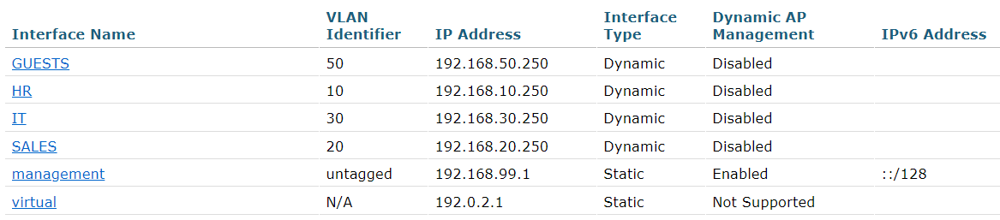

### WLC WLANs
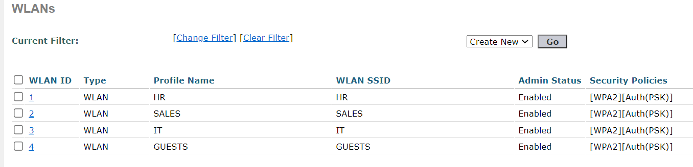

### LWAPs
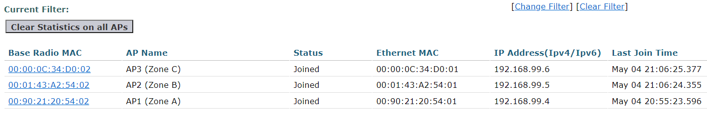

### Wireless Client Verification
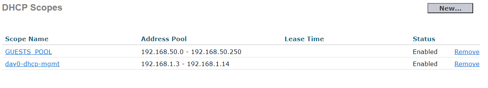

## Design Notes

- VLAN 99 is used as the native VLAN to support WLC management traffic.
- Packet Tracer WLC sends management traffic untagged, so the native VLAN must match VLAN 99.
## DHCP Design (Wireless)

### Guest WLAN (VLAN 50)

- DHCP is provided by the WLC instead of the centralized DHCP server.
- DHCP server is set to `192.168.99.1` (WLC management IP).
- This ensures wireless clients receive correct addressing in the `192.168.50.0/24` subnet.


### Other WLANs

- Continue using centralized DHCP (`192.168.40.4`)
- Still affected by Packet Tracer wireless limitations


## Packet Tracer Limitation and Workaround

Packet Tracer has a known issue where wireless client traffic appears to originate from the WLC management VLAN instead of the assigned VLAN, similar to JITL's lab https://youtu.be/Il8ev78fcqw?t=923.


### Observed Behavior

Wireless clients appear as `192.168.99.x` instead of their assigned VLAN subnet.


### Workaround Implemented

- Guest WLAN uses WLC internal DHCP  
- DHCP server is set to `192.168.99.1`  
- This forces correct subnet assignment (`192.168.50.0/24`)  

### Limitation Scope

- Only WLANs using WLC DHCP behave correctly  
- Other WLANs may still appear as VLAN 99 (`192.168.99.0/24`)  

## ACL Design for Guest Wireless

With the workaround:

- Guest clients correctly use `192.168.50.0/24`  
- Basic isolation ACLs can be applied on distribution switches normally on VLAN 50:
  
```cisco
ip access-list extended GUEST_BLOCK
 deny ip 192.168.50.0 0.0.0.255 192.168.0.0 0.0.255.255
 permit ip any any

interface vlan 50
 ip access-group GUEST_BLOCK in
```

### Policy Intent

- Deny access to internal VLANs (10,20,30,40)  
- Allow internet access  

## OSPF Requirement for Wireless

```cisco
router ospf 1
 network 192.168.99.0 0.0.0.255 area 0
```

### Reason

Due to Packet Tracer behavior, wireless traffic may still source from VLAN 99.  
Without this route, return traffic follows the default route and loops toward the internet.

## Key Takeaways

- Packet Tracer WLC behavior differs from real hardware  
- Native VLAN must match WLC management VLAN  
- DHCP can be offloaded to WLC as a workaround  
- OSPF must include all active VLANs (including management)  
- Wireless ACL enforcement depends on correct IP assignment  


## QoS Documentation

This section documents the voice-priority QoS policy used in the `labs/QoS.pkt` lab.

### QoS Summary

- Voice traffic is classified with ACL `VOICE-TRAFFIC` and class-map `VOICE`.
- Policy-map `MARK-VOICE` sets matched traffic to `dscp ef` and places it in the low-latency queue with `priority percent 30`.
- In the intended end-to-end design, `ASW1` marks voice traffic with DSCP, `DSW1-MAIN` and `DSW2-BACKUP` trust and preserve those markings, and routed devices such as `CR1`, `CR2`, and `EDGE` enforce priority queueing on egress.
- Because Packet Tracer QoS behavior is limited, the lab uses ACL-based voice matching as a practical workaround for consistent voice classification.

### Example Classification and Marking Policy

The current QoS policy objects visible in the lab are named `VOICE-TRAFFIC`, `VOICE`, and `MARK-VOICE`:

```cisco
ip access-list extended VOICE-TRAFFIC
 10 permit ip 192.168.100.0 0.0.0.255 any
 20 permit ip any 192.168.100.0 0.0.0.255
!
class-map match-any VOICE
 match access-group name VOICE-TRAFFIC
!
policy-map MARK-VOICE
 class VOICE
  set dscp ef
  priority percent 30
```

### QoS Testing

For the active Packet Tracer QoS demo, the test call is placed between `PH1` (`1001`) and `PH3` (`1003`), with both phones connected to `ASW1`. To generate traffic for validation, place a call from `PH1` to `PH3` or from `PH3` to `PH1`, then verify that the DSCP markings and QoS counters increment as expected.

The screenshot below shows `CR1` verifying the live policy on `GigabitEthernet0/0`. The `VOICE` class has matched traffic, the packets are being marked as `dscp ef`, and the strict-priority queue is active with `0` drops during the test.


### Verification Commands

```cisco
show access-lists VOICE-TRAFFIC
show class-map VOICE
show policy-map MARK-VOICE
show policy-map interface <interface>
show mls qos interface <trusted-switch-uplink>
```

### Packet Tracer Note

Packet Tracer does not always simulate congestion or best-effort packet drops realistically, even when multiple traffic generators are active. In this lab, the most reliable QoS validation comes from verifying DSCP preservation, class counters, and strict-priority queue statistics rather than expecting dramatic packet loss in competing traffic classes.

Packet Tracer can also fail to retain QoS-related configuration even after saving to startup config. Because of that, I decided to keep the active QoS demo scoped to `ASW1`, with `PH1` on `G1/0/1` and `PH3` on `G1/0/2`, so marking, trust, preservation, and queueing can be demonstrated more simply. This also makes re-applying the configuration far less tedious than rebuilding the same QoS setup across every access switch after each restart.

If QoS is not working, markings aren't preserved due to configs not being retained on Packet Tracer, reapply the config on the following:

```cisco
ASW1
interface g1/0/1
 service-policy input MARK-VOICE
interface g1/0/2
 service-policy input MARK-VOICE
CR1
interface g0/0
 service-policy output MARK-VOICE
interface g0/1
 service-policy output MARK-VOICE
!
CR2
interface g0/1
 service-policy output MARK-VOICE
!
EDGE
interface g0/0
 service-policy output MARK-VOICE
interface g0/1
 service-policy output MARK-VOICE
```

## Port Security Documentation

This section documents the access-layer port security settings added in the `labs/Port Security.pkt` lab.

### Port Security Summary

- `ASW1` and `ASW2` use sticky secure MAC learning on user-facing access ports.
- Those ports allow a maximum of `3` secure MAC addresses: one for the IP phone on the voice VLAN, one for the attached PC on the data VLAN, and one for internal switch control-plane MAC, which would otherwise trigger port-security violations if not included.
- `ASW3` uses manually configured secure MAC addresses instead of sticky learning because the connected services hosts are fixed devices in `VLAN 40`.
- Violation mode is set to `restrict` so unauthorized MAC addresses are dropped and counted without err-disabling the port.
- Port security is applied only on access ports, not on trunk links between switches.

### ASW1 and ASW2 Access Port Pattern

Apply the following pattern on host-facing ports connected to an IP phone and an attached PC:

```cisco
interface <access-port>
 switchport port-security
 switchport port-security maximum 3
 switchport port-security violation restrict
 switchport port-security mac-address sticky
```

### ASW3 Static Secure MAC Configuration

`ASW3` uses manually configured secure MAC addresses on the services VLAN access ports:

```cisco
interface GigabitEthernet1/0/1
 switchport port-security
 switchport port-security violation restrict
 switchport port-security mac-address 000C.852E.D689
!
interface GigabitEthernet1/0/2
 switchport port-security
 switchport port-security violation restrict
 switchport port-security mac-address 0004.9A34.B5A3
!
interface GigabitEthernet1/0/3
 switchport port-security
 switchport port-security violation restrict
 switchport port-security mac-address 0007.EC5C.3D58
!
interface GigabitEthernet1/0/4
 switchport port-security
 switchport port-security violation restrict
 switchport port-security mac-address 0060.47CB.1401
```

### Intended Behavior

- A known phone and PC can share the same secured access port on `ASW1` or `ASW2` without triggering a violation.
- On `ASW3`, only the manually approved services-host MAC addresses are allowed on `GigabitEthernet1/0/1` through `GigabitEthernet1/0/4`.
- If an unauthorized device is connected, the switch drops the offending frames, increments the security violation counter, and keeps the port up because `restrict` mode is used.

### Verification Commands

```cisco
show port-security
show port-security address
show port-security interface <interface>
show running-config interface <interface>
```

## DHCP Snooping and DAI Documentation

This section documents the Layer 2 DHCP snooping and Dynamic ARP Inspection controls carried forward into the latest `labs/ARP Inspection.pkt` lab.

### DHCP Snooping and DAI Summary

- DHCP snooping is used to protect the trusted DHCP service from rogue DHCP offers and access-port DHCP flooding.
- Dynamic ARP Inspection (DAI) is paired with DHCP snooping so ARP packets can be validated against trusted DHCP snooping information.
- The legitimate DHCP server remains the centralized services server at `192.168.40.4`.
- A rogue DHCP server is connected to `ASW1` on `GigabitEthernet1/0/6` as an untrusted test device.
- Trusted DHCP snooping ports are limited to uplinks and the known DHCP server path.
- Trusted DAI interfaces follow the same trusted-uplink design as DHCP snooping.
- Host-facing ports remain untrusted so client DHCP requests are allowed, but DHCP server replies from rogue devices are blocked.
- `PC4` / Host 4 on `ASW2` has a DHCP snooping rate limit of `1` packet per second for flooding validation.

### DHCP Snooping and DAI VLAN Scope

| Device | Protected VLAN(s) |
|---|---|
| `ASW1` | `10`, `30` |
| `ASW2` | `20` |
| `ASW3` | `40` |

### DHCP Snooping and DAI Configuration

#### ASW1

```cisco
ip dhcp snooping
ip dhcp snooping vlan 10,30
ip arp inspection vlan 10,30
ip arp inspection validate src-mac dst-mac ip
```

#### ASW2

```cisco
ip dhcp snooping
ip dhcp snooping vlan 20
ip arp inspection vlan 20
ip arp inspection validate src-mac dst-mac ip
```

#### ASW3

```cisco
ip dhcp snooping
ip dhcp snooping vlan 40
ip arp inspection vlan 40
ip arp inspection validate src-mac dst-mac ip
```

### Trusted Port Map

| Device | Trusted Interface(s) | Purpose |
|---|---|---|
| `ASW1` | `GigabitEthernet1/0/3` - `GigabitEthernet1/0/4` | Uplinks toward the distribution switches |
| `ASW2` | `GigabitEthernet1/0/1` - `GigabitEthernet1/0/2` | Uplinks toward the distribution switches |
| `ASW3` | `GigabitEthernet1/0/4` | trusted DHCP path between ASW3 and DHCP Server |
| `DSW1-MAIN` | `GigabitEthernet1/0/5` | Link connected to `ASW3` |
| `DSW2-BACKUP` | `GigabitEthernet1/0/5` | Link connected to `ASW3` |

### Rogue DHCP Server Test

The rogue DHCP server on `ASW1` `GigabitEthernet1/0/6` is intentionally connected on an untrusted port. During testing, the rogue server attempts to respond to DHCP requests, but DHCP snooping blocks the unauthorized server traffic before clients can use the rogue scope.

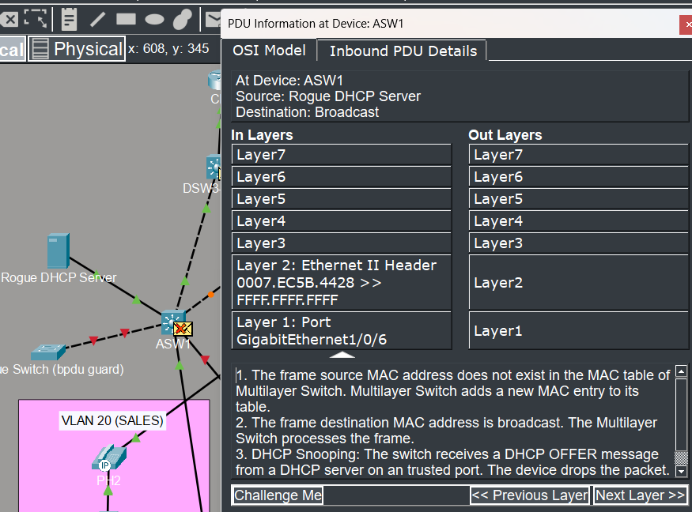

### Rate-Limit Flooding Test

Host 4 on `ASW2` is configured with a DHCP snooping rate limit of `1` packet per second. To trigger the test in Packet Tracer, use `PC4` > `Config` and quickly toggle the IP configuration between `Static` and `DHCP` multiple times. The switch should detect the burst and enforce the configured limit.

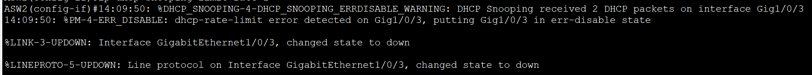

### DAI Validation Test

Packet Tracer does not allow duplicate IP addressing on the network, so a full ARP spoofing attack cannot be simulated in this lab. Instead, the DAI test focuses on showing that ARP inspection is enabled and actively validating packets based on the switch output shown below.

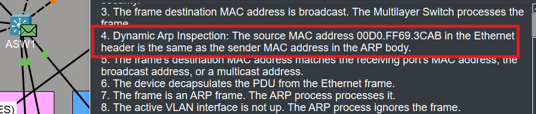

### Verification Commands

```cisco
show ip dhcp snooping
show ip dhcp snooping binding
show ip dhcp snooping statistics
show ip arp inspection
show ip arp inspection vlan
show ip arp inspection interfaces
show running-config | section dhcp snooping
show running-config | section arp inspection
show running-config interface <interface>
```

## Configuration Workflow

1. Configure hostnames on routers, switches, and hosts.
2. Configure the NTP server and clients.
3. Assign IPv4 and IPv6 addressing to end devices.
4. Create VLANs and configure VTP where required.
5. Build trunk links between switches.
6. Configure routed ports and WAN point-to-point links.
7. Enable RSTP and harden the edge with PortFast and BPDU Guard.
8. Create SVIs for inter-VLAN routing.
9. Verify VLAN reachability and gateway connectivity.
10. Add the voice VLAN on phone-facing access ports and verify IP phone registration.
11. Configure router interfaces and upstream connectivity.
12. Deploy OSPF and validate adjacency plus route exchange.
13. Add EtherChannel for redundancy and higher throughput.
14. Configure HSRP for resilient IPv4 default gateway services.
15. Add centralized DNS, DHCP, and NTP services for client and infrastructure support.
16. Configure SSH management access restrictions.
17. Configure SNMP and syslog monitoring for infrastructure visibility and testing.
18. Apply ACL policy controls and validate source-based filtering behavior.
19. Apply QoS trust, classification, marking, and priority queueing for voice traffic.
20. Apply port security on user-facing access ports and verify secure MAC learning or manual secure MAC bindings.
21. Configure DHCP snooping and Dynamic ARP Inspection trust boundaries plus access-port rate limits.
22. Test failover, path selection, name resolution, monitoring, VoIP behavior, access-layer security behavior, DHCP snooping behavior, DAI behavior, and end-to-end connectivity.

## Design Notes
- The topology is intentionally **progressive**, so each lab builds on earlier concepts instead of starting from zero.
- I use **VLSM planning and consistent gateway conventions** to keep addressing easy to read. I document subnetting in a step-by-step format before assigning addresses. This strengthens my **subnetting skills** by forcing me to calculate host requirements, masks, usable ranges, broadcasts, and the next available network instead of guessing.
- I include both **IPv4 and IPv6** to strengthen dual-stack configuration and troubleshooting skills.
- In Packet Tracer, **IPv4 uses HSRP virtual gateways**, while **IPv6 uses the `DSW1-MAIN` and `DSW2-BACKUP` SVI addresses** because an IPv6 virtual gateway is not used in this lab.
- **IPv6 routing is intentionally static** in this topology for practice, while **IPv4 dynamic routing uses OSPF**.
- Redundancy features such as **HSRP, EtherChannel, and STP protections** are included to reflect real design patterns.
- Core shared services are centralized in **VLAN 40**, with static server IPs, DHCP scopes for the data and voice VLANs, and the admin server providing DNS, NTP, and syslog reception.
- SSH management access is intentionally restricted to **VLAN 30 / IT** by applying a standard ACL to the VTY lines.
- The lab includes **IP phones on a separate `VLAN 100` voice network** so the same topology can be used for both VoIP and QoS validation.
- Packet Tracer QoS behavior is limited, so **ACL-based voice classification plus policy counters** are used to confirm DSCP marking and strict-priority treatment.
- Port security is applied at the access layer with **sticky learning on `ASW1` and `ASW2`** and **manual secure MAC bindings on `ASW3`** to reflect the difference between dynamic user ports and fixed services devices.
- DHCP snooping and DAI trust are applied only where DHCP replies and validated ARP traffic should legitimately travel, with rogue-server testing on `ASW1`, rate-limit testing on Host 4 connected to `ASW2`, and DAI verification via switch output because Packet Tracer does not model a duplicate-IP spoofing attack scenario.
- Packet Tracer monitoring features (SNMP and Syslog) are intentionally simple in this lab due to limitations.
- Basic device login security, such as local authentication on routers and switches, is intentionally skipped in this lab.

### Example VLSM Workflow

The same structured approach is used when building subnets for the lab. In this topology, the data and voice VLANs are intentionally kept as `/24` networks for simplicity and room to grow, while WAN point-to-point links use `/30` subnets:

```text
HR VLAN 10
Host bits: 2^8 = 256
Mask: 255.255.255.0
Network address: 192.168.10.0/24
Prefix: /24
Usable range: 192.168.10.1 - 192.168.10.254
Broadcast address: 192.168.10.255
Gateway: 192.168.10.254

Sales VLAN 20
Host bits: 2^8 = 256
Mask: 255.255.255.0
Network address: 192.168.20.0/24
Prefix: /24
Usable range: 192.168.20.1 - 192.168.20.254
Broadcast address: 192.168.20.255
Gateway: 192.168.20.254

IT VLAN 30
Host bits: 2^8 = 256
Mask: 255.255.255.0
Network address: 192.168.30.0/24
Prefix: /24
Usable range: 192.168.30.1 - 192.168.30.254
Broadcast address: 192.168.30.255
Gateway: 192.168.30.254

Services VLAN 40
Host bits: 2^8 = 256
Mask: 255.255.255.0
Network address: 192.168.40.0/24
Prefix: /24
Usable range: 192.168.40.1 - 192.168.40.254
Broadcast address: 192.168.40.255
Gateway: 192.168.40.254

Voice VLAN 100
Host bits: 2^8 = 256
Mask: 255.255.255.0
Network address: 192.168.100.0/24
Prefix: /24
Usable range: 192.168.100.1 - 192.168.100.254
Broadcast address: 192.168.100.255
Gateway: 192.168.100.254

Distribution to Core Routed P2P Links

CR1-DSW1-MAIN
Host bits: 2^2 = 4
Mask: 255.255.255.252
Network address: 10.0.0.0/30
Prefix: /30
Usable range: 10.0.0.1 - 10.0.0.2
Broadcast address: 10.0.0.3
Assigned link: CR1 10.0.0.1 <-> DSW1-MAIN 10.0.0.2
IPv6 pair: 2001:DB8:0:0::1 <-> 2001:DB8:0:0::2

CR1-DSW2-BACKUP
Host bits: 2^2 = 4
Mask: 255.255.255.252
Network address: 10.0.0.4/30
Prefix: /30
Usable range: 10.0.0.5 - 10.0.0.6
Broadcast address: 10.0.0.7
Assigned link: CR1 10.0.0.5 <-> DSW2-BACKUP 10.0.0.6
IPv6 pair: 2001:DB8:0:1::1 <-> 2001:DB8:0:1::2

CR2-DSW2-BACKUP
Host bits: 2^2 = 4
Mask: 255.255.255.252
Network address: 10.0.0.8/30
Prefix: /30
Usable range: 10.0.0.9 - 10.0.0.10
Broadcast address: 10.0.0.11
Assigned link: CR2 10.0.0.9 <-> DSW2-BACKUP 10.0.0.10
IPv6 pair: 2001:DB8:0:2::1 <-> 2001:DB8:0:2::2

CR2-DSW1-MAIN
Host bits: 2^2 = 4
Mask: 255.255.255.252
Network address: 10.0.0.12/30
Prefix: /30
Usable range: 10.0.0.13 - 10.0.0.14
Broadcast address: 10.0.0.15
Assigned link: CR2 10.0.0.13 <-> DSW1-MAIN 10.0.0.14
IPv6 pair: 2001:DB8:0:3::1 <-> 2001:DB8:0:3::2

CR1-EDGE P2P
Host bits: 2^2 = 4
Mask: 255.255.255.252
Network address: 203.0.113.0/30
Prefix: /30
Usable range: 203.0.113.1 - 203.0.113.2
Broadcast address: 203.0.113.3
IPv6 pair: 2001:DB8:113:1::1 <-> 2001:DB8:113:1::2

CR2-EDGE P2P
Host bits: 2^2 = 4
Mask: 255.255.255.252
Network address: 203.0.113.4/30
Prefix: /30
Usable range: 203.0.113.5 - 203.0.113.6
Broadcast address: 203.0.113.7
IPv6 pair: 2001:DB8:113:2::1 <-> 2001:DB8:113:2::2

EDGE-INTERNET
Host bits: 2^2 = 4
Mask: 255.255.255.252
Network address: 203.0.113.8/30
Prefix: /30
Usable range: 203.0.113.9 - 203.0.113.10
Broadcast: 203.0.113.11
Next network: 203.0.113.12
IPv6 pair: 2001:DB8:113:3::1 <-> 2001:DB8:113:3::2
```

## Next Steps

As this portfolio grows, the next features I plan to add to the current lab include:

- LAN and WAN architecture features such as GRE tunnels
- Virtualization, cloud, containers, and VRF concepts
- Wireless fundamentals, architecture, security, and configuration
- Network automation topics such as JSON, XML, YAML, REST APIs, SDN, Ansible, Puppet, Chef, and Terraform
- A future rebuild of the lab in EVE-NG or GNS3 overcoming Packet Tracer's limitations.

---
