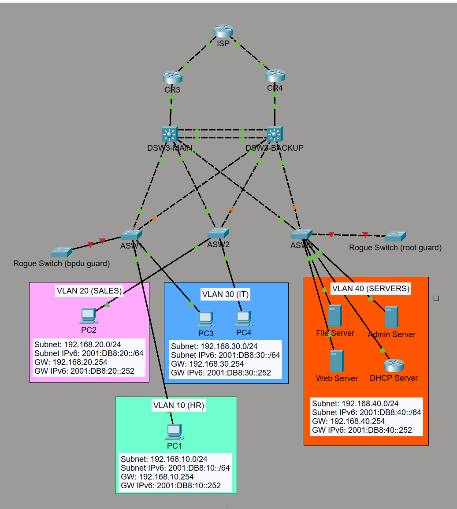

# CCNA Networking Lab Portfolio

A growing collection of Cisco Packet Tracer labs documenting my hands-on CCNA practice in switching, routing, redundancy, and IPv6.



## Overview

This repository serves as my **networking portfolio** while I work through my CCNA course and build practical configuration skills in Packet Tracer.

Instead of treating each topic as a completely separate project, I use an **evolving topology** that becomes more advanced over time. That approach helps me practice how networks are built, expanded, verified, and troubleshot.

## What This Repo Shows

- VLAN creation and segmentation
- VTP and trunking between switches
- Inter-VLAN routing with SVIs and Layer 3 switching
- RSTP, PortFast, BPDU Guard, and Root Guard
- EtherChannel for redundancy and bandwidth
- OSPF routing and failover path behavior
- FHRP for resilient IPv4 default gateways
- IPv4 and IPv6 dual-stack addressing
- Static routing and WAN edge connectivity
- Extended ACL policy enforcement for service-based access control

## Lab Files

These Packet Tracer labs show the progression of the topology and the topics covered:

| Lab File | Main Focus |
|---|---|
| `VTP.pkt` | VLAN propagation and switch domain setup |
| `VLAN - L2 Switch (ROAS) + Subinterfaces.pkt` | Router-on-a-stick and inter-VLAN routing |
| `VLAN - L3 Switch (P2P) + SVI.pkt` | Layer 3 switching with SVIs and routed links |
| `RSTP with portfast, bpduguard, root guard.pkt` | Spanning-tree protection features |
| `Etherchannel.pkt` | Aggregated uplinks and redundancy |
| `FHRP (Active, Standby).pkt` | IPv4 default gateway redundancy |
| `OSPF (cost changed going to backup router).pkt` | Dynamic routing and path preference |
| `IPv6.pkt` | Dual-stack addressing with IPv6 static routes |
| `extended ACL.pkt` | Per-VLAN extended ACLs for service-based access control |

## Topology Snapshot

The current lab design includes:

- Three user VLANs: HR, Sales, and IT
- Two distribution / multilayer switches acting as primary and backup gateways
- Redundant uplinks between access and distribution layers
- Dual upstream routers connected to an ISP
- IPv4 and IPv6 addressing throughout the environment

## Addressing Plan

### VLAN Networks

| VLAN | Department | IPv4 Subnet | IPv4 Gateway | IPv6 Subnet | IPv6 Router Addressing |
|---|---|---|---|---|---|
| 10 | HR | `192.168.10.0/24` | `192.168.10.254` | `2001:DB8:10::/64` | `2001:DB8:10::252` (DSW3-main), `2001:DB8:10::253` (DSW3-backup) |
| 20 | Sales | `192.168.20.0/24` | `192.168.20.254` | `2001:DB8:20::/64` | `2001:DB8:20::252` (DSW3-main), `2001:DB8:20::253` (DSW3-backup) |
| 30 | IT | `192.168.30.0/24` | `192.168.30.254` | `2001:DB8:30::/64` | `2001:DB8:30::252` (DSW3-main), `2001:DB8:30::253` (DSW3-backup) |

### Example End-Host Addressing

| VLAN | Example IPv4 Host | Example IPv6 Host |
|---|---|---|
| 10 | `192.168.10.1` | `2001:DB8:10::1` |
| 20 | `192.168.20.1` | `2001:DB8:20::1` |
| 30 | `192.168.30.1` | `2001:DB8:30::1` |

### FHRP / Gateway Pattern

The multilayer switches follow a predictable addressing structure to make verification and troubleshooting easier.

For this Packet Tracer lab, FHRP is used for IPv4 only. IPv6 does not use a virtual gateway address here because IPv6 FHRP is not working reliably in Packet Tracer, so the hosts reference the physical SVI addresses on the multilayer switches instead.

| Role | IPv4 Pattern | IPv6 Pattern |
|---|---|---|
| Main multilayer switch SVI | `192.168.x.252` | `2001:DB8:x::252` |
| Backup multilayer switch SVI | `192.168.x.253` | `2001:DB8:x::253` |
| Virtual default gateway | `192.168.x.254` | Not used in this Packet Tracer IPv6 lab |

Replace `x` with the VLAN number such as `10`, `20`, or `30`.

### Point-to-Point WAN Links

| Link | IPv4 Subnet | Router Address | ISP Address | IPv6 Subnet | Router IPv6 | ISP IPv6 |
|---|---|---|---|---|---|---|
| R3 to ISP | `203.0.113.0/30` | `203.0.113.1` | `203.0.113.2` | `2001:DB8:113:1::/64` | `2001:DB8:113:1::1` | `2001:DB8:113:1::2` |
| R4 to ISP | `203.0.113.4/30` | `203.0.113.5` | `203.0.113.6` | `2001:DB8:113:2::/64` | `2001:DB8:113:2::1` | `2001:DB8:113:2::2` |

## Extended ACL Documentation

This section documents the extended ACL policy applied on both `DSW3-MAIN` and `DSW3-BACKUP` in the Packet Tracer lab.

### Policy Summary

- `ACL 110` is applied to `VLAN 10` inbound and allows the `192.168.10.0/24` subnet to use FTP with server `192.168.40.1`.
- `ACL 120` is applied to `VLAN 20` inbound and blocks HTTP while permitting selected HTTPS and DNS traffic toward server `192.168.40.3`.
- The same ACL definitions and interface bindings are configured on both multilayer switches so the policy remains consistent during gateway failover.
- Because these are extended ACLs placed close to the source, the filtering happens as traffic enters the source VLAN SVI on the multilayer switch.

### Service Test Setup

- The web server at `192.168.40.3` is also configured as a DNS server.
- A DNS `A` record for `cisco.com` points to `192.168.40.3`.
- Hosts in `VLAN 20` use `192.168.40.3` as their DNS server so the lab can test both HTTPS and DNS behavior through `ACL 120`.

### ACL Configuration on DSW3-MAIN

```cisco
ip access-list extended 110
 permit tcp 192.168.10.0 0.0.0.255 host 192.168.40.1 eq ftp
 permit tcp host 192.168.40.1 eq ftp 192.168.10.0 0.0.0.255
!
ip access-list extended 120
 deny tcp any any eq www
 permit tcp 192.168.20.0 0.0.0.255 host 192.168.40.3 eq 443
 permit tcp host 192.168.40.3 eq 443 192.168.20.0 0.0.0.255
 permit udp 192.168.20.0 0.0.0.255 host 192.168.40.3 eq domain
!
interface vlan 10
 ip access-group 110 in
!
interface vlan 20
 ip access-group 120 in
```

### ACL Configuration on DSW3-BACKUP

```cisco
ip access-list extended 110
 permit tcp 192.168.10.0 0.0.0.255 host 192.168.40.1 eq ftp
 permit tcp host 192.168.40.1 eq ftp 192.168.10.0 0.0.0.255
!
ip access-list extended 120
 deny tcp any any eq www
 permit tcp 192.168.20.0 0.0.0.255 host 192.168.40.3 eq 443
 permit tcp host 192.168.40.3 eq 443 192.168.20.0 0.0.0.255
 permit udp 192.168.20.0 0.0.0.255 host 192.168.40.3 eq domain
!
interface vlan 10
 ip access-group 110 in
!
interface vlan 20
 ip access-group 120 in
```

### Intended Behavior

- Hosts in `VLAN 10` can establish FTP sessions with `192.168.40.1`.
- Hosts in `VLAN 20` are blocked from HTTP destinations that match the ACL.
- Hosts in `VLAN 20` can resolve `cisco.com` to `192.168.40.3`, and that DNS traffic is permitted by the ACL.
- Hosts in `VLAN 20` are permitted to reach `192.168.40.3` on HTTPS after resolving the name or by using the direct IP address.

### Verification Commands

```cisco
show access-lists
show run interface vlan 10
show run interface vlan 20
show ip interface vlan 10
show ip interface vlan 20
show hosts
```

### Packet Tracer Note

Packet Tracer has a known issue where extended ACLs can remain in the saved configuration but stop filtering correctly after the lab is closed and reopened. In this lab, the workaround is to re-apply the ACL to each VLAN interface after every Packet Tracer restart. The issue is described in this Cisco Community thread: <https://community.cisco.com/t5/switching/packet-tracer-acls-remain-in-config-but-stop-working-after/m-p/5378191#M587005>.

Use the following commands to re-apply the ACL bindings on each multilayer switch:

```cisco
interface vlan 10
 ip access-group 110 in
!
interface vlan 20
 ip access-group 120 in
```

## Configuration Workflow

This is the general sequence I follow as the topology evolves:

1. Configure hostnames on routers, switches, and hosts.
2. Assign IPv4 and IPv6 addressing to end devices.
3. Create VLANs and configure VTP where required.
4. Build trunk links between switches.
5. Configure routed ports and WAN point-to-point links.
6. Enable RSTP and harden the edge with PortFast and BPDU Guard.
7. Create SVIs for inter-VLAN routing.
8. Verify VLAN reachability and gateway connectivity.
9. Configure router interfaces and upstream connectivity.
10. Deploy OSPF and validate adjacency plus route exchange.
11. Add EtherChannel for redundancy and higher throughput.
12. Configure FHRP for resilient IPv4 default gateway services.
13. Apply ACL policy controls and validate source-based filtering behavior.
14. Test failover, path selection, and end-to-end connectivity.

## Design Notes
- The topology is intentionally **progressive**, so each lab builds on earlier concepts instead of starting from zero.
- I use **VLSM planning and consistent gateway conventions** to keep addressing easy to read. I document subnetting in a step-by-step format before assigning addresses. This strengthens my **subnetting skills** by forcing me to calculate host requirements, masks, usable ranges, broadcasts, and the next available network instead of guessing.
- I include both **IPv4 and IPv6** to strengthen dual-stack configuration and troubleshooting skills.
- In Packet Tracer, **IPv4 uses FHRP virtual gateways**, while **IPv6 uses the physical DSW3-main and DSW3-backup SVI addresses** because an IPv6 virtual gateway is not used in this lab.
- Redundancy features such as **FHRP, EtherChannel, and spanning-tree protections** are included to reflect real design patterns.

### Example VLSM Workflow

The same structured approach is used when building subnets for the lab. In this topology, the user VLANs are intentionally kept as `/24` networks for simplicity and room to grow, while WAN point-to-point links use `/30` subnets:

```text
HR VLAN 10
Host bits: 2^8 = 256
Mask: 255.255.255.0
Network address: 192.168.10.0/24
Prefix: /24
Usable range: 192.168.10.1 - 192.168.10.254
Broadcast address: 192.168.10.255
Gateway: 192.168.10.254

Sales VLAN 20
Host bits: 2^8 = 256
Mask: 255.255.255.0
Network address: 192.168.20.0/24
Prefix: /24
Usable range: 192.168.20.1 - 192.168.20.254
Broadcast address: 192.168.20.255
Gateway: 192.168.20.254

IT VLAN 30
Host bits: 2^8 = 256
Mask: 255.255.255.0
Network address: 192.168.30.0/24
Prefix: /24
Usable range: 192.168.30.1 - 192.168.30.254
Broadcast address: 192.168.30.255
Gateway: 192.168.30.254

R3-ISP P2P
Host bits: 2^2 = 4
Mask: 255.255.255.252
Network address: 203.0.113.0/30
Prefix: /30
Usable range: 203.0.113.1 - 203.0.113.2
Broadcast address: 203.0.113.3

R4-ISP P2P
Host bits: 2^2 = 4
Mask: 255.255.255.252
Network address: 203.0.113.4/30
Prefix: /30
Usable range: 203.0.113.5 - 203.0.113.6
Broadcast address: 203.0.113.7
```

## Next Steps

As this portfolio grows, I plan to add:

- More annotated screenshots
- Per-lab notes and verification outputs
- Troubleshooting scenarios and recovery steps
- Additional routing, security, and services labs as I progress to my CCNA lectures

---
