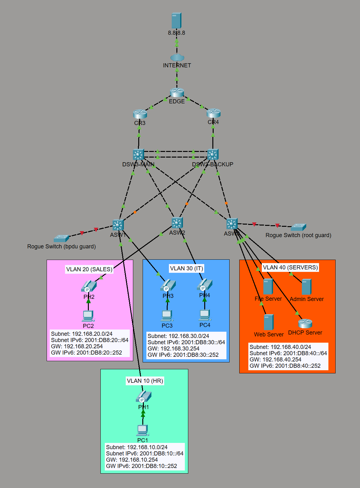
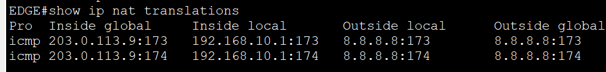
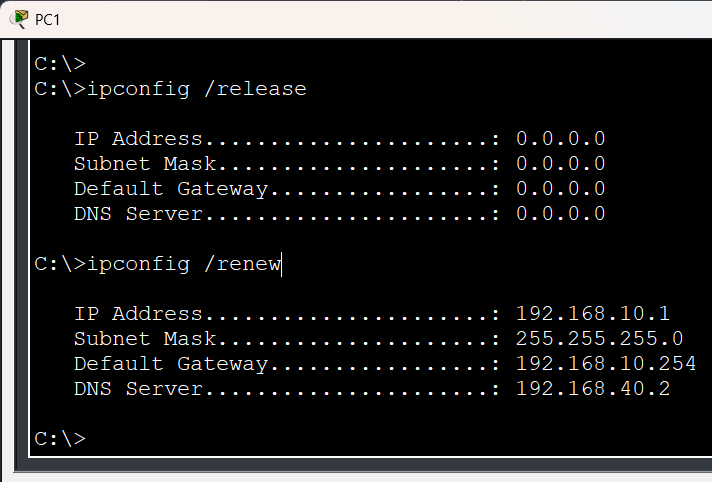
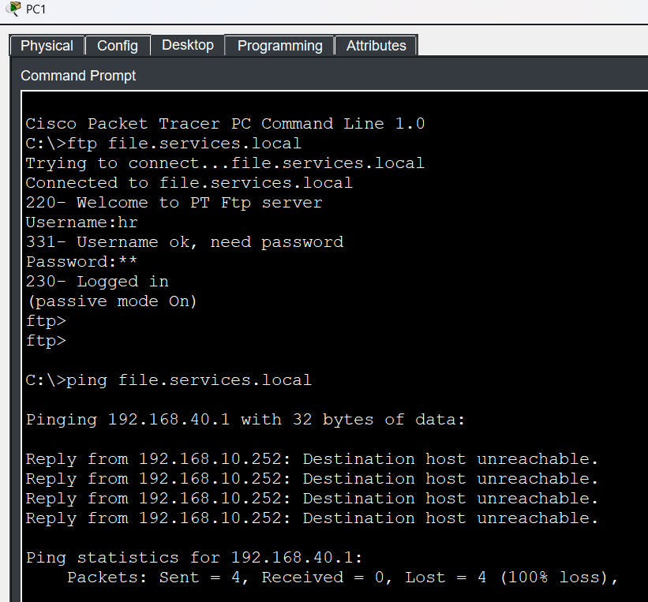
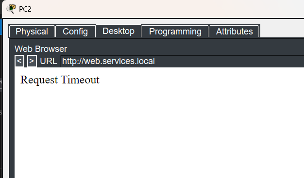
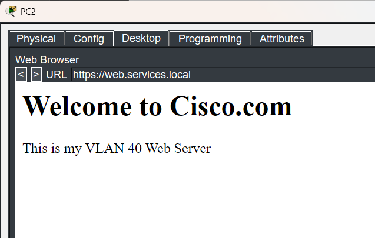
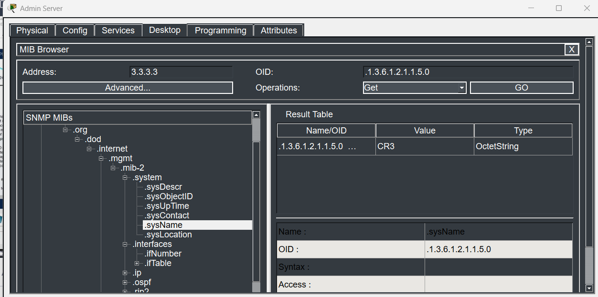
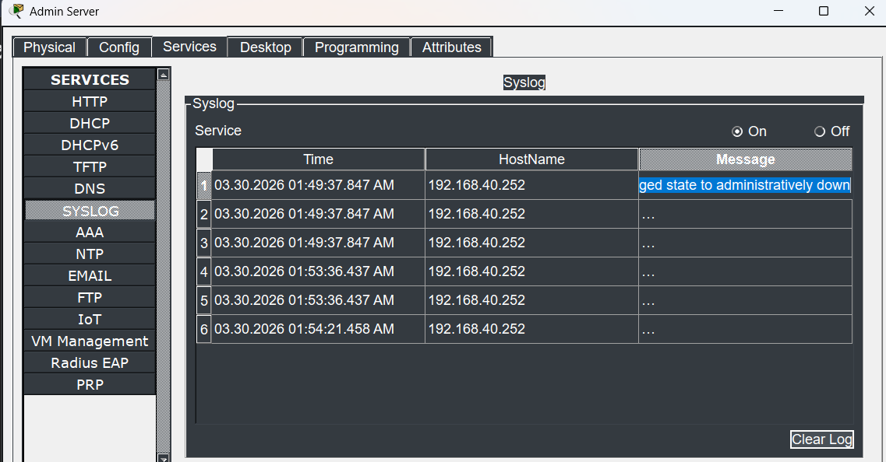
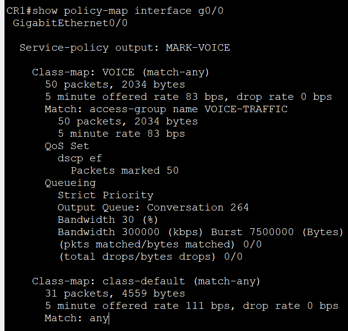

# CCNA Networking Lab Portfolio

A growing collection of Cisco Packet Tracer labs documenting my hands-on CCNA practice.



## Table of Contents

- [Overview](#overview)
- [What This Repo Shows](#what-this-repo-shows)
- [Lab Files](#lab-files)
- [Topology Snapshot](#topology-snapshot)
- [Addressing Plan](#addressing-plan)
- [VTP Documentation](#vtp-documentation)
- [PVST Documentation](#pvst-documentation)
- [EtherChannel Documentation](#etherchannel-documentation)
- [OSPF Documentation](#ospf-documentation)
- [NAT Documentation](#nat-documentation)
- [Extended ACL Documentation](#extended-acl-documentation)
- [DNS and DHCP Documentation](#dns-and-dhcp-documentation)
- [NTP Documentation](#ntp-documentation)
- [SNMP and Syslog Documentation](#snmp-and-syslog-documentation)
- [SSH Documentation](#ssh-documentation)
- [VoIP Documentation](#voip-documentation)
- [QoS Documentation](#qos-documentation)
- [Configuration Workflow](#configuration-workflow)
- [Design Notes](#design-notes)
- [Next Steps](#next-steps)

## Overview

This repository serves as my **networking portfolio** while I work through my CCNA course and build practical configuration skills in Packet Tracer.

Instead of treating each topic as a completely separate project, I use an **evolving topology** that becomes more advanced over time. That approach helps me practice how networks are built, expanded, verified, and troubleshot.

## What This Repo Shows

- VLAN creation and segmentation
- VTP and trunking between switches
- Inter-VLAN routing with SVIs and Layer 3 switching
- RSTP, PortFast, BPDU Guard, and Root Guard
- EtherChannel for redundancy and bandwidth
- OSPF routing and failover path behavior
- FHRP for resilient IPv4 default gateways
- IPv4 and IPv6 dual-stack addressing
- Static routing, NAT/PAT, and WAN edge connectivity
- Extended ACL policy enforcement for service-based access control
- Centralized DNS and DHCP services for user VLANs
- Centralized NTP for consistent device timestamps across routers and switches
- Basic SNMP and syslog monitoring validation in Packet Tracer
- Restricted SSH management access from the IT VLAN
- VoIP phone access ports with a separate voice VLAN
- QoS classification, DSCP EF marking, trust boundaries, and strict priority queueing for voice traffic

## Lab Files

These Packet Tracer labs show the progression of the topology and the topics covered:

| Lab File | Main Focus |
|---|---|
| `VTP.pkt` | VLAN propagation and switch domain setup |
| `VLAN (ROAS).pkt` | Router-on-a-stick and inter-VLAN routing |
| `VLAN (P2P).pkt` | Layer 3 switching with SVIs and routed links |
| `RSTP.pkt` | Spanning-tree protection features |
| `Etherchannel.pkt` | Aggregated uplinks and redundancy |
| `FHRP.pkt` | IPv4 default gateway redundancy |
| `OSPF.pkt` | Dynamic routing and path preference |
| `IPv6.pkt` | Dual-stack addressing with IPv6 static routes |
| `Extended ACL.pkt` | Per-VLAN extended ACLs for service-based access control |
| `DNS & DHCP.pkt` | Centralized DNS and DHCP services added to the services VLAN |
| `SNMP & Syslog.pkt` | SNMP communities and syslog testing to the admin server |
| `NAT.pkt` | `EDGE` PAT overload for inside local networks and internet access |
| `SSH.pkt` | SSH management access enabled on distribution switches with IT VLAN restrictions |
| `QoS - VLAN100.pkt` | Initial voice VLAN 100 build used to prepare VoIP traffic for QoS testing |
| `QoS.pkt` | Latest VoIP and QoS lab with preserved DSCP markings and priority queue validation |

## Topology Snapshot

The current lab design includes:

- Four VLANs: HR, Sales, IT, and Services
- Two distribution / multilayer switches acting as primary and backup gateways
- An EtherChannel bundle between `DSW3-MAIN` and `DSW3-BACKUP` for inter-switch redundancy
- Redundant uplinks between access and distribution layers
- Dual upstream routers connected to the `EDGE` internet router
- Dynamic NAT overload (PAT) on `EDGE` for inside local addresses reaching outside networks
- Centralized services in `VLAN 40`, including file, admin (w/DNS, NTP, syslog), web, and DHCP servers
- DHCP scope delivery for user VLANs `10`, `20`, and `30`
- Cisco IP phones added at the access layer with a dedicated `VLAN 100` voice segment
- QoS policy testing across redundant routed paths through `DSW3-MAIN`, `DSW3-BACKUP`, `CR3`, `CR4`, and `EDGE`
- IPv4 and IPv6 addressing throughout the environment

## Addressing Plan

### VLAN Networks

| VLAN | Department | IPv4 Subnet | IPv4 Gateway | IPv6 Subnet | IPv6 Router Addressing |
|---|---|---|---|---|---|
| 10 | HR | `192.168.10.0/24` | `192.168.10.254` | `2001:DB8:10::/64` | `2001:DB8:10::252` (DSW3-main), `2001:DB8:10::253` (DSW3-backup) |
| 20 | Sales | `192.168.20.0/24` | `192.168.20.254` | `2001:DB8:20::/64` | `2001:DB8:20::252` (DSW3-main), `2001:DB8:20::253` (DSW3-backup) |
| 30 | IT | `192.168.30.0/24` | `192.168.30.254` | `2001:DB8:30::/64` | `2001:DB8:30::252` (DSW3-main), `2001:DB8:30::253` (DSW3-backup) |
| 40 | Services | `192.168.40.0/24` | `192.168.40.254` | `2001:DB8:40::/64` | `2001:DB8:40::252` (DSW3-main), `2001:DB8:40::253` (DSW3-backup) |

### Example End-Host Addressing

| VLAN | Example IPv4 Host | Example IPv6 Host |
|---|---|---|
| 10 | `192.168.10.1` | `2001:DB8:10::1` |
| 20 | `192.168.20.1` | `2001:DB8:20::1` |
| 30 | `192.168.30.1` | `2001:DB8:30::1` |
| 40 | `192.168.40.1` | `2001:DB8:40::1` |

### Services VLAN Infrastructure

| Service | Hostname | IPv4 Address | Role |
|---|---|---|---|
| File Server | `file.services.local` | `192.168.40.1` | FTP service for `VLAN 10` testing with account `hr` / `hr` |
| Admin Server | `admin.services.local` | `192.168.40.2` | DNS, NTP, and syslog receiver for the lab |
| Web Server | `web.services.local` | `192.168.40.3` | HTTPS service for `VLAN 20` testing |
| DHCP Server | `dhcp.services.local` | `192.168.40.4` | DHCP pools for `VLAN 10` through `VLAN 30` |

### Voice VLAN Note

The later VoIP and QoS lab stages add a dedicated `VLAN 100` voice segment for the IP phones connected to the access ports. The PCs remain in their original departmental data VLANs while the phones tag voice traffic separately for call processing and QoS validation.

### FHRP / Gateway Pattern

The multilayer switches follow a predictable addressing structure to make verification and troubleshooting easier.

For this Packet Tracer lab, FHRP is used for IPv4 only. IPv6 does not use a virtual gateway address here because IPv6 FHRP is not working reliably in Packet Tracer, so the hosts reference the SVI addresses on the multilayer switches instead.

| Role | IPv4 Pattern | IPv6 Pattern |
|---|---|---|
| Main multilayer switch SVI | `192.168.x.252` | `2001:DB8:x::252` |
| Backup multilayer switch SVI | `192.168.x.253` | `2001:DB8:x::253` |
| Virtual default gateway | `192.168.x.254` | Not used in this Packet Tracer IPv6 lab |

Replace `x` with the VLAN number such as `10`, `20`, `30`, or `40`.

### Point-to-Point WAN Links

| Link | IPv4 Subnet | Internal Router Address | EDGE / Next-Hop Address | IPv6 Subnet | Internal Router IPv6 | EDGE IPv6 |
|---|---|---|---|---|---|---|
| R3 to EDGE | `203.0.113.0/30` | `203.0.113.1` | `203.0.113.2` | `2001:DB8:113:1::/64` | `2001:DB8:113:1::1` | `2001:DB8:113:1::2` |
| R4 to EDGE | `203.0.113.4/30` | `203.0.113.5` | `203.0.113.6` | `2001:DB8:113:2::/64` | `2001:DB8:113:2::1` | `2001:DB8:113:2::2` |
| EDGE to Internet | `203.0.113.8/30` | `203.0.113.9` | `203.0.113.10` | Not used | Not used | Not used |

## VTP Documentation

This section documents the basic VTP setup used in the switching portion of the lab.

### Design Summary

- The VTP domain is configured as `cisco`.
- `DSW3-MAIN` is configured as the VTP server for VLAN management.
- This setup is kept intentionally simple because the lab is also being used to study VLAN provisioning and future automation or scripting workflows.

### Example Configuration

#### DSW3-MAIN

```cisco
vtp domain cisco
vtp mode server
```

#### VTP Clients

```cisco
vtp domain cisco
vtp mode client
```

### Verification Commands

```cisco
show vtp status
show vlan brief
```

## PVST Documentation

This section documents the PVST configuration used to stabilize Layer 2 paths and protect edge ports.

### Design Summary

- PVST is enabled for per-VLAN spanning-tree control.
- `DSW3-MAIN` is configured as the root primary switch for all VLANs.
- `DSW3-BACKUP` is configured as the root secondary switch for all VLANs.
- STP protections, including PortFast, BPDU Guard, and Root Guard, are applied on the access switches rather than on the distribution switches.
- On the access switches, these features speed host connectivity and help prevent accidental switch connections or unexpected root-bridge changes.

### Example Configuration

#### DSW3-MAIN

```cisco
spanning-tree mode pvst
spanning-tree vlan 1,10,20,30,40 root primary
```

#### DSW3-BACKUP

```cisco
spanning-tree mode pvst
spanning-tree vlan 1,10,20,30,40 root secondary
```

#### Access Switch Edge Protection

```cisco
spanning-tree mode pvst
spanning-tree portfast default
spanning-tree bpduguard default
```

### Verification Commands

```cisco
show spanning-tree
show spanning-tree vlan 10
show spanning-tree summary
show spanning-tree inconsistentports
```

## EtherChannel Documentation

This section documents the EtherChannel link configured between `DSW3-MAIN` and `DSW3-BACKUP`.

### Design Summary

- The direct inter-switch uplinks between `DSW3-MAIN` and `DSW3-BACKUP` are bundled into a single EtherChannel for redundancy and additional bandwidth.
- This keeps the distribution layer resilient because the logical port-channel remains available if one member link fails.
- The bundled inter-switch link also simplifies spanning-tree operation by presenting the parallel links as one logical path.

### Intended Behavior

- Traffic between the two multilayer switches can continue flowing even if a single physical member link goes down.
- The switches treat the port-channel as one logical connection instead of separate parallel trunks.
- The EtherChannel provides both redundancy and higher aggregate throughput across the distribution pair.

### Verification Commands

```cisco
show etherchannel summary
show interfaces trunk
show spanning-tree
```

## OSPF Documentation

This section documents the OSPF design used for dynamic routing and failover behavior in the lab.

### Loopback Router IDs

| Device | Loopback Address | OSPF Router ID |
|---|---|---|
| `DSW3-MAIN` | `1.1.1.1/32` | `1.1.1.1` |
| `DSW3-BACKUP` | `2.2.2.2/32` | `2.2.2.2` |
| `R3` | `3.3.3.3/32` | `3.3.3.3` |
| `R4` | `4.4.4.4/32` | `4.4.4.4` |
| `EDGE` | `5.5.5.5/32` | `5.5.5.5` |

### OSPF Design Summary

- Each Layer 3 device uses a loopback interface to provide a stable OSPF router ID.
- OSPF is configured in a single area only: `area 0`.
- On the multilayer switches, VLAN SVIs are advertised through `network` statements with wildcard masks under the OSPF process.
- Physical routed interfaces are enabled individually under the interface with `ip ospf 1 area 0`.
- OSPF is used to advertise internal routed paths and upstream connectivity across the lab.
- `EDGE` originates the default route into OSPF so the internal routers learn outside reachability.
- The topology is designed so path preference and failover can be observed when the primary route changes or becomes unavailable.

### Example Loopback and Router ID Configuration

#### DSW3-MAIN

```cisco
interface loopback0
 ip address 1.1.1.1 255.255.255.255
!
router ospf 1
 router-id 1.1.1.1
 network 1.1.1.1 0.0.0.0 area 0
 network 192.168.10.0 0.0.0.255 area 0
 network 192.168.20.0 0.0.0.255 area 0
 network 192.168.30.0 0.0.0.255 area 0
 network 192.168.40.0 0.0.0.255 area 0
```

#### DSW3-BACKUP

```cisco
interface loopback0
 ip address 2.2.2.2 255.255.255.255
!
router ospf 1
 router-id 2.2.2.2
 network 2.2.2.2 0.0.0.0 area 0
 network 192.168.10.0 0.0.0.255 area 0
 network 192.168.20.0 0.0.0.255 area 0
 network 192.168.30.0 0.0.0.255 area 0
 network 192.168.40.0 0.0.0.255 area 0
```

#### R3

```cisco
interface loopback0
 ip address 3.3.3.3 255.255.255.255
!
router ospf 1
 router-id 3.3.3.3
```

#### R4

```cisco
interface loopback0
 ip address 4.4.4.4 255.255.255.255
!
router ospf 1
 router-id 4.4.4.4
```

#### EDGE

```cisco
ip route 0.0.0.0 0.0.0.0 203.0.113.10
!
router ospf 1
 default-information originate
```

### Routed Interface OSPF Enablement

```cisco
interface <routed-uplink>
 ip ospf 1 area 0
```

### Verification Commands

```cisco
show ip ospf neighbor
show ip route ospf
show ip ospf interface brief
show ip protocols
```

## NAT Documentation

This section documents the `EDGE` router configuration used to provide outside connectivity for the internal lab networks.

### NAT Summary

- `EDGE` is the internet-edge router for the lab.
- Dynamic NAT overload (PAT) is used so inside local addresses can share the public outside interface when reaching external networks.
- The NAT ACL permits the internal `192.168.0.0/16` address space.
- Internal-facing interfaces on `EDGE` are configured as `ip nat inside`, and the internet-facing interface is configured as `ip nat outside`.
- `EDGE` uses a default route to `203.0.113.10` and advertises that default route into OSPF.
- Hosts in the internal VLANs can reach external destinations such as the `8.8.8.8` internet server through PAT.

### NAT ACL on EDGE

```cisco
ip access-list standard NAT_IN
 permit 192.168.0.0 0.0.255.255
```

### Example PAT and Routing Configuration

```cisco
interface <inside-interface>
 ip nat inside
!
interface <outside-interface>
 ip nat outside
!
ip nat inside source list NAT_IN interface <outside-interface> overload
ip route 0.0.0.0 0.0.0.0 203.0.113.10
!
router ospf 1
 default-information originate
```

### NAT Test

The screenshot below shows `EDGE` building PAT translations while an inside host reaches the `8.8.8.8` internet server.



### Verification Commands

```cisco
show access-lists NAT_IN
show ip nat translations
show ip nat statistics
show ip route
show ip protocols
```

## Extended ACL Documentation

This section documents the named extended ACL policy applied on both `DSW3-main` and `DSW3-backup` in the Packet Tracer lab.

### Policy Summary

- `HR_IN` is applied inbound on `VLAN 10` and permits DHCP first, DNS second, and FTP third for HR clients.
- `HR_OUT` is applied outbound on `VLAN 10` and permits the matching DHCP, DNS, and FTP return traffic back toward the HR subnet.
- `SALES_IN` is applied inbound on `VLAN 20` and permits DHCP first, DNS second, and HTTPS third for Sales clients.
- `SALES_OUT` is applied outbound on `VLAN 20` and permits the matching DHCP, DNS, and HTTPS return traffic back toward the Sales subnet.
- The same ACL definitions and interface bindings are configured on both `DSW3-main` and `DSW3-backup` so the policy remains consistent during gateway failover.
- Traffic that does not match those permitted services is dropped by the ACLs' implicit deny.

### Service Test Setup

- DNS is hosted on the admin server at `192.168.40.2` in `VLAN 40`.
- The current DNS `A` records are `admin.services.local`, `dhcp.services.local`, `file.services.local`, and `web.services.local`.
- HR clients use DNS plus FTP to reach the file server, while Sales clients use DNS plus HTTPS to reach the web server.
- The HR FTP validation account is username `hr` with password `hr`.

### ACL Configuration on DSW3-main and DSW3-backup

```cisco
ip access-list extended HR_IN
 permit udp any eq bootpc any eq bootps
 permit udp 192.168.10.0 0.0.0.255 host 192.168.40.4
 permit udp 192.168.10.0 0.0.0.255 host 192.168.40.2 eq domain
 permit tcp 192.168.10.0 0.0.0.255 host 192.168.40.1 eq ftp
!
ip access-list extended HR_OUT
 permit udp host 192.168.40.4 192.168.10.0 0.0.0.255
 permit udp host 192.168.40.2 eq domain 192.168.10.0 0.0.0.255
 permit tcp host 192.168.40.1 eq ftp 192.168.10.0 0.0.0.255
!
ip access-list extended SALES_IN
 permit udp any eq bootpc any eq bootps
 permit udp 192.168.20.0 0.0.0.255 host 192.168.40.4
 permit udp 192.168.20.0 0.0.0.255 host 192.168.40.2 eq domain
 permit tcp 192.168.20.0 0.0.0.255 host 192.168.40.3 eq 443
!
ip access-list extended SALES_OUT
 permit udp host 192.168.40.4 192.168.20.0 0.0.0.255
 permit udp host 192.168.40.2 eq domain 192.168.20.0 0.0.0.255
 permit tcp host 192.168.40.3 eq 443 192.168.20.0 0.0.0.255
!
interface vlan 10
 ip access-group HR_IN in
 ip access-group HR_OUT out
!
interface vlan 20
 ip access-group SALES_IN in
 ip access-group SALES_OUT out
```

### Intended Behavior

- Hosts in `VLAN 10` can obtain DHCP, resolve `file.services.local` through `192.168.40.2`, and establish FTP sessions with `192.168.40.1` using `hr` / `hr`.
- Hosts in `VLAN 20` can obtain DHCP, resolve `web.services.local` through `192.168.40.2`, and reach `192.168.40.3` over HTTPS.
- Return traffic for those approved flows is permitted by the outbound ACLs on `VLAN 10` and `VLAN 20`.
- Other traffic, such as an HR client trying to `ping file.services.local`, is denied after DHCP, DNS, and FTP are matched.

### PC1 ACL Test

The screenshots below show the expected `VLAN 10` behavior from `PC1`: DHCP succeeds first, DNS resolves the FTP server second, FTP is allowed third, and a later ping is denied by the ACL.

#### PC1 DHCP Test



#### PC1 FTP and Ping Test



### PC2 Web Tests

The screenshots below show the `VLAN 20` browser tests from `PC2` against `web.services.local`.

#### PC2 HTTP Test



#### PC2 HTTPS Test



### Verification Commands

```cisco
show access-lists
show run interface vlan 10
show run interface vlan 20
show ip interface vlan 10
show ip interface vlan 20
show hosts
```

### Packet Tracer Note

Packet Tracer has a known issue where extended ACLs can remain in the saved configuration but stop filtering correctly after the lab is closed and reopened. In this lab, the workaround is to re-apply the ACL to each VLAN interface on `DSW3-main` and `DSW3-backup` after every Packet Tracer restart. The issue is described in this Cisco Community thread: <https://community.cisco.com/t5/switching/packet-tracer-acls-remain-in-config-but-stop-working-after/m-p/5378191#M587005>.

Use the following commands to re-apply the ACL bindings on `DSW3-main` and `DSW3-backup`:

```cisco
interface vlan 10
 ip access-group HR_IN in
 ip access-group HR_OUT out
!
interface vlan 20
 ip access-group SALES_IN in
 ip access-group SALES_OUT out
```

## DNS and DHCP Documentation

This section documents the centralized services added in the latest Packet Tracer lab version.

### DNS Summary

- The admin server at `192.168.40.2` now hosts DNS for the lab.
- The current `services.local` `A` records are:
  - `file.services.local` -> `192.168.40.1`
  - `admin.services.local` -> `192.168.40.2`
  - `web.services.local` -> `192.168.40.3`
  - `dhcp.services.local` -> `192.168.40.4`
- Packet Tracer does not support DDNS for end hosts, so host devices cannot be reached by domain name unless you create static DNS records for them manually.
- This keeps name resolution centralized in the services VLAN instead of tying DNS to the web server.

### DHCP Summary

- A dedicated DHCP server at `192.168.40.4` provides address pools for `VLAN 10`, `VLAN 20`, and `VLAN 30`.
- Addresses `.250` through `.254` are excluded in each user VLAN so they remain available for static assignments such as gateways, routers, and servers.
- Services in `VLAN 40` continue to use static addressing.

### DHCP Excluded Addresses

```cisco
ip dhcp excluded-address 192.168.10.250 192.168.10.254
ip dhcp excluded-address 192.168.20.250 192.168.20.254
ip dhcp excluded-address 192.168.30.250 192.168.30.254
```

## NTP Documentation

This section documents the time synchronization baseline used across the routing and switching devices in the lab.

### NTP Summary

- The admin server at `192.168.40.2` also acts as the NTP server for the lab.
- All routers and switches are configured to use `192.168.40.2` as their NTP source.
- The lab standard timezone is `AEST`, configured on Cisco devices as `clock timezone AEST 10 0` for Australian Eastern Standard Time (`UTC+10`).
- This keeps timestamps aligned across the topology for troubleshooting, syslog review, and general verification.

### Router and Switch Baseline Configuration

Apply the following on each router and switch in the topology:

```cisco
clock timezone AEST 10 0
ntp server 192.168.40.2
```

### Verification Commands

```cisco
show clock detail
show ntp associations
show running-config | include clock timezone|ntp server
```

## SNMP and Syslog Documentation

This section documents the basic monitoring features added in the latest Packet Tracer lab version.

### SNMP Summary

- `R3` is configured for SNMP community-string based monitoring.
- The configured community strings are `ciscorw` for read/write access and `ciscoro` for read-only access.
- To test SNMP, use the Packet Tracer MIB Browser on any host and query `R3` at `3.3.3.3` or `192.168.1.254` on UDP port `161`.

### MIB Browser Advanced Tab Example Values

| Setting | Value |
|---|---|
| Address | `3.3.3.3` |
| Port | `161` |
| Read Community | `ciscoro` |
| Write Community | `ciscorw` |
| SNMP Version | `v1` |

### R3 SNMP Configuration

```cisco
snmp-server community ciscorw RW
snmp-server community ciscoro RO
```

### SNMP Test Screenshot



### Syslog Summary

- Syslog is enabled only on `DSW3-main` in this lab version for testing.
- The admin server at `192.168.40.2` is configured as the syslog receiver.
- Trap logging is configured at the `debugging` level in Packet Tracer.

### DSW3-main Syslog Configuration

```cisco
logging trap debugging
logging 192.168.40.2
```

### Syslog Test Screenshot



### Packet Tracer Limitations

- SNMP configuration commands in this lab is limited to community strings with `SNMPv1` and `SNMPv2`.
- Syslog handling is simplified, and this lab uses the limited `debugging` trap level for testing.

## SSH Documentation

This section documents the SSH access restriction used for device management in the lab.

### SSH Summary

- SSH access to the network devices is limited to the IT subnet `192.168.30.0/24`.
- A standard ACL named `SSH_IN` is applied inbound on the VTY lines to restrict which hosts can open SSH sessions.
- For demo and testing, only `DSW3-MAIN` and `DSW3-BACKUP` are SSH-enabled devices.
- The local SSH test credentials are username `it` and password `ccna`.
- This keeps management access separated from the HR and Sales user VLANs.

### SSH Access ACL

```cisco
ip access-list standard SSH_IN
 permit 192.168.30.0 0.0.0.255
```

### VTY Settings

```cisco
line vty 0 4
 access-class SSH_IN in
 exec-timeout 5 0
 login local
 transport input ssh
!
line vty 5 15
 access-class SSH_IN in
 exec-timeout 5 0
 login local
 transport input ssh
```

### Demo and Testing Commands

Use either SSH format below from a host in the IT VLAN:

```text
ssh -l it 192.168.30.252
ssh -l it 192.168.30.253
ssh it@192.168.30.252
ssh it@192.168.30.253
```

- `192.168.30.252` = `DSW3-MAIN`
- `192.168.30.253` = `DSW3-BACKUP`

### Verification Commands

```cisco
show access-lists SSH_IN
show running-config | section line vty
```

## VoIP Documentation

This section documents the VoIP baseline added in the later Packet Tracer lab versions.

### VoIP Summary

- Four IP phones, `PH1` through `PH4`, are added to the access layer for call testing.
- The phones use a dedicated `VLAN 100` voice segment while the attached PCs stay in their existing data VLANs.
- Both `DSW3-MAIN` and `DSW3-BACKUP` carry the voice VLAN so phone reachability survives the redundant distribution design.
- The telephony setup is intentionally lightweight for CCNA practice: register the phones, assign extensions, and generate voice traffic that can be classified by the QoS policy.

### Access Port Pattern

Apply the following pattern on user-facing access ports that connect an IP phone with a PC behind it:

```cisco
interface <phone-access-port>
 switchport mode access
 switchport access vlan <10|20|30>
 switchport voice vlan 100
 spanning-tree portfast
```

### Example CME / Telephony Baseline

The current Packet Tracer call-processing baseline on `R3` uses the following CME values:

```cisco
telephony-service
 max-ephones 10
 max-dn 10
 ip source-address 3.3.3.3 port 2000
 auto assign 1 to 10
!
ephone-dn 1
 number 1001
!
ephone-dn 2
 number 1002
!
ephone-dn 3
 number 1003
!
ephone-dn 4
 number 1004
!
ephone 1
 device-security-mode none
 mac-address 00E0.B000.2EA6
 type 7960
 button 1:1
!
ephone 2
 device-security-mode none
 mac-address 0001.4345.1632
 type 7960
 button 1:2
!
ephone 3
 device-security-mode none
 mac-address 0002.4A98.228C
 type 7960
 button 1:3
!
ephone 4
 device-security-mode none
 mac-address 00D0.BC55.DCBE
 type 7960
 button 1:4
```

### Verification Commands

```cisco
show vlan brief
show interfaces switchport
show ephone registered
show telephony-service ephone
```

## QoS Documentation

This section documents the voice-priority QoS policy used in the latest `QoS.pkt` lab.

### QoS Summary

- Voice traffic is classified with ACL `VOICE-TRAFFIC` and class-map `VOICE`.
- Policy-map `MARK-VOICE` sets matched traffic to `dscp ef` and places it in the low-latency queue with `priority percent 30`.
- The latest QoS build preserves voice markings across all routed paths tested through `DSW3-MAIN`, `DSW3-BACKUP`, `CR3`, `CR4`, and `EDGE`.
- `DSW3-MAIN` acts as the switched trust boundary, while the routed devices enforce priority queueing on the egress path.
- Because Packet Tracer QoS behavior is limited, the lab uses ACL-based voice matching as a practical workaround for consistent voice classification.

### Example Classification and Marking Policy

The current QoS policy objects visible in the lab are named `VOICE-TRAFFIC`, `VOICE`, and `MARK-VOICE`:

```cisco
ip access-list extended VOICE-TRAFFIC
 10 permit ip 192.168.100.0 0.0.0.255 any
 20 permit ip any 192.168.100.0 0.0.0.255
!
class-map match-any VOICE
 match access-group name VOICE-TRAFFIC
!
policy-map MARK-VOICE
 class VOICE
  set dscp ef
  priority percent 30
```

### Trust and Service-Policy Pattern

```cisco
interface <trusted-switch-uplink>
 mls qos trust dscp
!
interface <routed-egress-interface>
 service-policy output MARK-VOICE
```

### QoS Testing

The screenshot below shows `CR3` verifying the live policy on `GigabitEthernet0/1`. The `VOICE` class has matched traffic, the packets are being marked as `dscp ef`, and the strict-priority queue is active with `0` drops during the test.



### Verification Commands

```cisco
show access-lists VOICE-TRAFFIC
show class-map VOICE
show policy-map MARK-VOICE
show policy-map interface g0/1
show mls qos interface <trusted-switch-uplink>
```

### Packet Tracer Note

Packet Tracer does not always simulate congestion or best-effort packet drops realistically, even when multiple traffic generators are active. In this lab, the most reliable QoS validation comes from verifying DSCP preservation, class counters, and strict-priority queue statistics rather than expecting dramatic packet loss in competing traffic classes.

Packet Tracer can also fail to retain the `service-policy output MARK-VOICE` attachment on routed interfaces after the lab is closed and reopened, even though the QoS objects themselves still exist in the saved configuration. If that happens, re-apply the policy to the routed egress interfaces below after every Packet Tracer restart:

```cisco
CR3
interface g0/0
 service-policy output MARK-VOICE
interface g0/1
 service-policy output MARK-VOICE
!
CR4
interface g0/1
 service-policy output MARK-VOICE
!
EDGE
interface g0/0
 service-policy output MARK-VOICE
interface g0/1
 service-policy output MARK-VOICE
```

## Configuration Workflow

1. Configure hostnames on routers, switches, and hosts.
2. Configure the NTP server and clients.
3. Assign IPv4 and IPv6 addressing to end devices.
4. Create VLANs and configure VTP where required.
5. Build trunk links between switches.
6. Configure routed ports and WAN point-to-point links.
7. Enable RSTP and harden the edge with PortFast and BPDU Guard.
8. Create SVIs for inter-VLAN routing.
9. Verify VLAN reachability and gateway connectivity.
10. Add the voice VLAN on phone-facing access ports and verify IP phone registration.
11. Configure router interfaces and upstream connectivity.
12. Deploy OSPF and validate adjacency plus route exchange.
13. Add EtherChannel for redundancy and higher throughput.
14. Configure FHRP for resilient IPv4 default gateway services.
15. Add centralized DNS, DHCP, and NTP services for client and infrastructure support.
16. Configure SSH management access restrictions.
17. Configure SNMP and syslog monitoring for infrastructure visibility and testing.
18. Apply ACL policy controls and validate source-based filtering behavior.
19. Apply QoS trust, classification, marking, and priority queueing for voice traffic.
20. Test failover, path selection, name resolution, monitoring, VoIP behavior, and end-to-end connectivity.

## Design Notes
- The topology is intentionally **progressive**, so each lab builds on earlier concepts instead of starting from zero.
- I use **VLSM planning and consistent gateway conventions** to keep addressing easy to read. I document subnetting in a step-by-step format before assigning addresses. This strengthens my **subnetting skills** by forcing me to calculate host requirements, masks, usable ranges, broadcasts, and the next available network instead of guessing.
- I include both **IPv4 and IPv6** to strengthen dual-stack configuration and troubleshooting skills.
- In Packet Tracer, **IPv4 uses FHRP virtual gateways**, while **IPv6 uses the DSW3-main and DSW3-backup SVI addresses** because an IPv6 virtual gateway is not used in this lab.
- Redundancy features such as **FHRP, EtherChannel, and STP protections** are included to reflect real design patterns.
- Core shared services are centralized in **VLAN 40**, with static server IPs, DHCP scopes for the user VLANs, and the admin server providing DNS, NTP, and syslog reception.
- SSH management access is intentionally restricted to **VLAN 30 / IT** by applying a standard ACL to the VTY lines.
- Later lab versions add **IP phones on a separate voice VLAN** so the same topology can be used for both VoIP and QoS validation.
- Packet Tracer QoS behavior is limited, so **ACL-based voice classification plus policy counters** are used to confirm DSCP marking and strict-priority treatment.
- Packet Tracer monitoring features (SNMP and Syslog) are intentionally simple in this lab due to limitations.
- Basic device login security, such as local authentication on routers and switches, is intentionally skipped in this lab.

### Example VLSM Workflow

The same structured approach is used when building subnets for the lab. In this topology, the user VLANs are intentionally kept as `/24` networks for simplicity and room to grow, while WAN point-to-point links use `/30` subnets:

```text
HR VLAN 10
Host bits: 2^8 = 256
Mask: 255.255.255.0
Network address: 192.168.10.0/24
Prefix: /24
Usable range: 192.168.10.1 - 192.168.10.254
Broadcast address: 192.168.10.255
Gateway: 192.168.10.254

Sales VLAN 20
Host bits: 2^8 = 256
Mask: 255.255.255.0
Network address: 192.168.20.0/24
Prefix: /24
Usable range: 192.168.20.1 - 192.168.20.254
Broadcast address: 192.168.20.255
Gateway: 192.168.20.254

IT VLAN 30
Host bits: 2^8 = 256
Mask: 255.255.255.0
Network address: 192.168.30.0/24
Prefix: /24
Usable range: 192.168.30.1 - 192.168.30.254
Broadcast address: 192.168.30.255
Gateway: 192.168.30.254

Services VLAN 40
Host bits: 2^8 = 256
Mask: 255.255.255.0
Network address: 192.168.40.0/24
Prefix: /24
Usable range: 192.168.40.1 - 192.168.40.254
Broadcast address: 192.168.40.255
Gateway: 192.168.40.254

R3-EDGE P2P
Host bits: 2^2 = 4
Mask: 255.255.255.252
Network address: 203.0.113.0/30
Prefix: /30
Usable range: 203.0.113.1 - 203.0.113.2
Broadcast address: 203.0.113.3

R4-EDGE P2P
Host bits: 2^2 = 4
Mask: 255.255.255.252
Network address: 203.0.113.4/30
Prefix: /30
Usable range: 203.0.113.5 - 203.0.113.6
Broadcast address: 203.0.113.7

EDGE-INTERNET
Host bits: 2^2 = 4
Mask: 255.255.255.252
Network address: 203.0.113.8/30
Prefix: /30
Usable range: 203.0.113.9 - 203.0.113.10
Broadcast: 203.0.113.11
Next network: 203.0.113.12
```

## Next Steps

As this portfolio grows, the next features I plan to add to the current lab include:

- Security features such as port security, DHCP snooping, and Dynamic ARP Inspection
- LAN and WAN architecture features such as STP/FHRP synchronization and GRE tunnels
- Virtualization, cloud, containers, and VRF concepts
- Wireless fundamentals, architecture, security, and configuration
- Network automation topics such as JSON, XML, YAML, REST APIs, SDN, Ansible, Puppet, Chef, and Terraform
- More screenshots, verification outputs, and troubleshooting scenarios
- A future rebuild of the lab in EVE-NG or GNS3 overcoming Packet Tracer's limitations.

---
